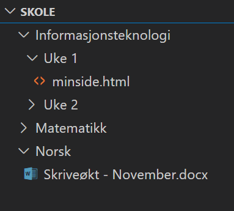

# Filer og Mapper

Alt du har på datamaskinen din består av filer. Tekster, bilder, film og spill, alle apper og program du bruker utgjør til sammen mange hundretusener (om ikke millioner) av filer. 

*Office-pakka du installerer her på skolen består av ganske mange filer* 

Vi sorterer disse filene i mapper slik at vi får en enklere struktur. Programmene du bruker er avhengig av at filene både eksisterer og ligger på riktig plass. Som bruker av digitale verktøy så trenger vi egentlig ikke lenger å vite hvor alt dette befinner seg. Ting går av seg selv og vi har gode søkemotorer som leter opp det vi eventuelt trenger. Når vi nå skal lage egne nettsteder og få en bedre forståelse om hvordan det hele henger sammen, blir det anderledes. Nå blir det viktigere å forstå fil- og mappestruktur, samt hvordan du navigerer deg på rundt på datamaskinen din.

## Lokal lagring og Skylagring

Hver gang du lagrer en ny fil, for eksempel en tekst eller et bilde, bestemmer du samtidig hvor filen skal plasseres. Mange lagrer kanskje filene i en standardmappe uten å tenke over hvor, mens andre allerede har laget seg sitt eget system med mapper for fag på skolen og lignende.

Du har som regel valget om å lagre lokalt eller i en sky. Lokal lagring betyr at filene lagres fysisk på datamaskinen din, og tar plass på denne. Dersom maskinen blir ødelagt eller borte så forsvinner fila. 

Skylagring betyr at du laster opp fila til en server via internett. En server kan i dette tilfellet sees på som en annen datamaskin i et stort datasenter designet for slike formål. Du trenger da tilgang til internett for å kunne lagre og få tak i fila di. Siden filene nå er lagret "på internett", vil du lett kunne få tilgang til de selv om du må bytte maskin. 

Det finnes fordeler og bakdeler med begge varianter, men med så stabil internett-tilgang vi har nå, så lagres mye i skyen. Det er vanlig å `synkronisere` lagringen, som betyr at filene lagres både lokalt og i skyen samtidig. 

> Mange av de nyere Mac maskinene er satt opp slik at alt automatisk lagres i den integrerte
> skytjenesten iCloud. Hvis du har opplevd at du ikke får lagret en fil uten internett-tilgang,
> så har du et slikt oppsett.

> Når du lagrer filene enten lokalt eller i en sky så opptar de plass. Du har ikke uendelig
> lagringskapasitet, spesielt lokalt. Med skylagring kan du i teorien lagre store mengder av 
> data, men det vil fort koste penger.

## Navigere

For å manuelt lete blant filene og mappene vi har (både lokalt og i skyen) så bruker vi i utgangspunktet "File Explorer" (PC) eller "Finder" (MAC). Her kan vi hoppe inn og ut av mapper for å utforske hvilke filer/mapper som ligger hvor. 

> Dersom man ikke er vant med å bruke disse, så kan det hele være noe forvirrende, spesielt på MAC
> som prøver å skjule fil og mappestruktur så langt det lar seg gjøre. Her legges det opp til at
> du lett kan søke deg frem til det du trenger.

VS-Code har også en innebygd utforsker som vi bruker mye i dette faget, for å bruke denne så åpner vi først en mappe så vil VS-Code vise deg hva som som ligger inne i denne. Vi kan åpne og lukke mapper ved å trykke på pilene. Husk at dersom vi åpner en helt ny mappe så betyr ikke det at lagrede filene vi hadde oppe tidligere forsvinner, vi bare utforsker et annet sted.

*Ser du hvilke hvordan fil- og mappestrukturen er bygd opp? Hva ligger inne hvor?*

## Filtyper og Filnavn

Det finnes veldig mange ulike filtyper, du er trolig mest vant til er sikkert bildefiler, tekstfiler eller eventuelt videofiler. I tillegg er det alle de "usynlige" filene som alle programmene og appene dine består av. Anta at du lagrer en tekst og gir den navnet "Norsk Skriveøkt". Dersom den er skrevet i word blir den faktisk lagret som "Norsk Skriveøkt.docx" der docx står for filtypen. Hittil har dette skjedd automatisk uten at du trenger å forholde deg til det, men med VS Code blir det anderledes. Dette programmet brukes for mange ulike filtyper, og vi må derfor manuelt spesifisere hva slags type fil vi skal lage. Det gjør vi ved å gi den et navn, så ha med et punktum og riktig "filkode" når vi lagrer filene våre. I neste kapittel skal vi for eksempel lage en html-fil. Den må da lagres på formen *navn*.html der du bestemmer navnet selv,

## Oppgaver

### Oppgave 1 - IT-mappe

1. Opprett en IT-mappe på PCen din  
2. Åpne mappen i VS Code  

### Oppgave 2 - Word-dokument

1. Opprett et nytt word-dokument i MS Word  
2. Skriv `IT er kult!` i dokumentet  
3. Lagre dokumentet i IT-mappen din  
4. Finn word-dokumentet i VS Code, hva får du opp?  
5. Lag en ny word-fil (`.doc`) i VS Code, som inneholder teksten `Hei på deg!`  
6. Dobbelklikk på filen i Explorer/Finder, hva skjer?  

### Oppgave 3 - Filnavn

1. Legg et bilde av deg selv i IT-mappen  
2. Finn bildet i VS Code, hva får du opp?  
3. Endre navn på bildet, slik at det slutter på `.doc`  
4. Dobbeltklikk på bildet i Explorer/Finder, hva skjer?  
5. Hvorfor skjer dette?  
