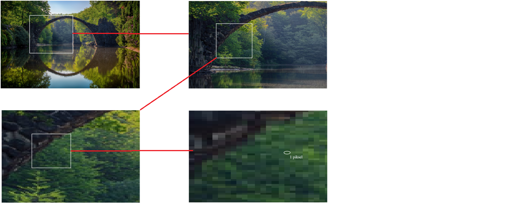
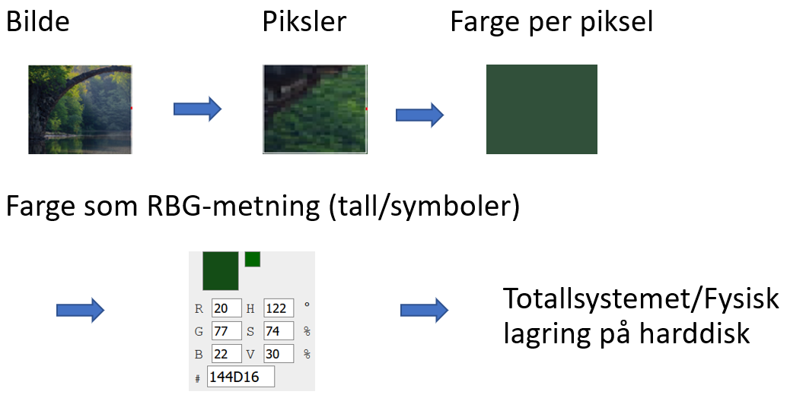

## Piksler

Vi skal nå se på hvordan vi kan lagre et bilde som en rekke med 0 og 1. Da må vi først se nærmere på hvordan et bilde egentlig er bygd opp på datamaskinen. Velg deg et bilde du selv har lagret og zoom inn så langt du klarer. Det vil etterhvert se ut som en rekke med fargede firkanter:

Hver firkant kalles for en **piksel** eller et bildepunkt. Oppløsningen et bilde har tilsvarer antall piksler i bredden og høyden, et bilde med oppløsning 1200x1000 har altså 1200 piksler i bredden og 1000 i høyden. Det tilsvarer totalt 1 200 000 piksler, altså "firkanter" med hver sin farge. Vi kan tenke oss at dersom vi klarer å gjøre hver piksel sin farge om til 0 og 1, så kan vi lagre disse fargene i en bestemt rekkefølge som bits eller bytes. Da vil programmet som skal vise bildet kunne lese en kjempelang rekke med 0 og 1, gjøre de om til farger, så til slutt å sette de sammen i den riktige rekkefølgen. 

## Farger

La oss se nærmere på hvordan farger fungerer på en datamaskin. Du har kanskje lært at ved å bruke fargene rød, gul og blå så kan man lage alle andre farger? Det er en regel som fungerer greit når vi skal male, men en dataskjerm gir fra seg lys, og da bruker vi **rød**, **grønn** og **blå** som primærfarger. Ved å justere metningen av disse tre fargene vil vi kunne lage alle andre farger vi trenger på skjermen. Når vi ikke sender ut noen av fargene vil skjermen være svart. Dersom vi sender ut maksimalt av alle tre (rød, blå og grønn),  vil det oppfattes som hvitt på skjermen! 

### Fargevelger

import RgbSlider from '@site/src/components/RgbSlider'

<RgbSlider />
 

:::tip

Bruk fargevelgeren over og juster på metningen av de tre primærfargene og se hvor mange forskjellige farger du får opp.

:::

Legg merke til at metningen kan justeres i en skala fra 0 til 255. Det tilsvarer 8 bit, altså en byte! Vi setter altså av en byte for å bestemme hvor mye metning det er av hver primærfarge, totalt 3 bytes. Det betyr at hvis en piksel for eksempel skal være oransje så vil den informasjonen kreve 3 bytes i minne.

## Bilder

Vi kan nå gå gjennom den teoretiske prosessen bak det å lagre et bilde: 

1. Datamaskinen analyserer den første pikselen i bildet
2. Fargen på pikselen gjøres om til et tall som representerer metningen av hver primærfarge. 
3. Dette tallet skrives om til totalls-systemet og vil være av størrelsesorden 3 bytes
4. Raden med 0 og 1 som tilsvarer fargen lagres som elektriske tilstander på datamaskinen
5. Gjenta 1 - 4 for hver eneste piksel i bildet.

Et bilde med oppløsning 1200x1000 vil derfor trenge 3 bytes ganger 1 200 000 med plass, altså 3 600 000 bytes, eller 3.6 megabytes. Siden en byte er 8 bits krever bildet i teorien altså 28 800 000 elektroniske tilstander på en datamaskin. I virkeligheten vil nok bildet ta mindre plass, fordi man har funnet smarte teknikker for å **komprimere** informasjonen som kreves.
