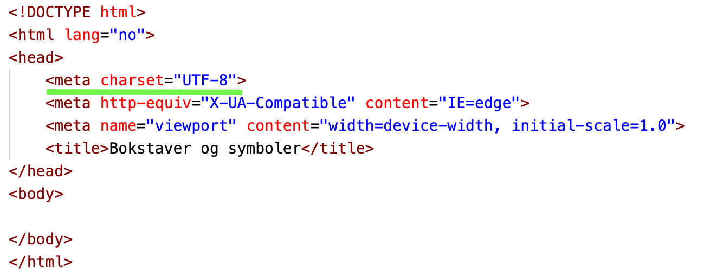

# Lagring av bokstaver og symboler

Som vi har sett på i de forrige delkapitlene forstår i utgangspunktet datamaskiner ikke noe mer enn 0 og 1.
Ta for eksempel rekken `01000001`, hvis vi tenker at det er et tall i totallsystemet, representerer tallrekken tallet 65 i titallsystemet.
Datamaskinen vet ingenting om tallet 65, den ser bare rekken `01000001`, det at det representerer tallet 65 er bare noe vi mennesker har funnet på.

Hvis vi blir enige om at `00001` representerer bokstaven `A` og `00010` representerer bokstaven `B`, `00011` representerer `C` og så videre for alle bokstavene i alfabetet helt til at `11100` representerer `Å`.
Da vil vi kunne representere hele alfabetet med kombinasjoner av 0 og 1, og ved å sette sammen bokstavene kan vi representere hele ord.
F.eks. vil `HEI` vil være `01000` `00101` `01001`.

## Tegnsett

> Tegnsett er tabeller som kobler sammen tegn og tall.

På 60-tallet laget en gruppe amerikanere en tabell som koblet sammen tall og tegn.
Tabellen het ASCII (American Standard Code for Information Interchange), og ble den nye standarden for hvordan datamaskiner skulle tolke bokstaver fra kombinasjoner av 0 og 1.
Amerikanerne bestemte seg for at i ASCII-tabellen er `A` lik `0100 0001` som blir tallet `65` i titallsystemet, `B` er lik `0100 0010` som blir `66` i titallssystemet osv.

ASCII-tabellen brukte bare 7-bit, som gjorde at den bare hadde plass til 128 forskjellige tegn.
Æ,Ø og Å var for eksempel ikke med i tabellen.
Derfor utviklet etterhvert andre tabeller som bygde på ASCII.
Blant andre lagde Microsoft sin egen tabell, ANSI, med 8-bit som ga mulighet for 256 tegn (inkludert Æ,Ø og Å).

I dag er Unicode-tabellen den vanligste, den består av 256-tegn (8-bit).

> Det finnes og større utvidelser av unicode-tabellen. UTF-16 (16-bits) og UTF-32 (32-bits), men de er relativt lite brukt.

| Tall i titalsystemet|Tall i totallssytemet|Tegn            |
| --------------------|---------------------|----------------|
| 65                  |0100 0001            | A              |
| 66                  |0100 0010            | B              |
| 67                  |0100 0011            | C              |
| 68                  |0100 0100            | D              |
| 69                  |0100 0101            | E              |
| ...                 | ...                 | ...            |
| 97                  |0110 0001            | a              |
| 98                  |0110 0010            | b              |
| 99                  |0110 0011            | c              |
| 100                 |0110 0100            | d              |
| ...                 | ...                 | ...            |
| 197                 |1100 0101            | Å              |
| 198                 |1100 0110            | Æ              |
| ...                 | ...                 | ...            |
| 216                 |1101 1000            | Ø              |

Tabellen over er et utdrag av Unicode-tabellen.

## Tegn i programmeringsspråk

Du har kanskje lagt merke til at vi skriver `<meta charset="utf-8">` i `<head>` i HTML-filene våre.
Det er her du velger hvilket tegnsett (tabell) datamaskinen skal bruke for å tolke innholdet i HTML-filen.
`UTF-8` står for Unicode 8-bits.

Når vi lagrer informasjon digitalt er det vi som mennesker som må fortelle datamaskinen hvordan den skal tolke kombinasjonen av 0 og 1.
*Vanlige* folk merker ikke noe til dette, fordi det er programmert inn i datamaskinene og appene vi bruker, men de som lager datamaskinene og appene må fortelle datamaskinen hvordan den skal tolke all informasjon som skal vises eller lagres.

I programmeringsspråket javascript forteller vi datamaskinen at den skal tolke noe som tekst ved å sette anførselstegn rundt teksten, slik `"Tekst i javascript"`.
Hvis du f.eks setter anførselstegn rundt tall, slik `"23"`, tolker datamaskinen det som tekst.
En typisk nybegynnerfeil i programmering er å gjøre matte på to tekster, for eksempel blir `"23" + "23"` lik `"2323"`.
