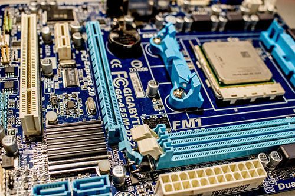
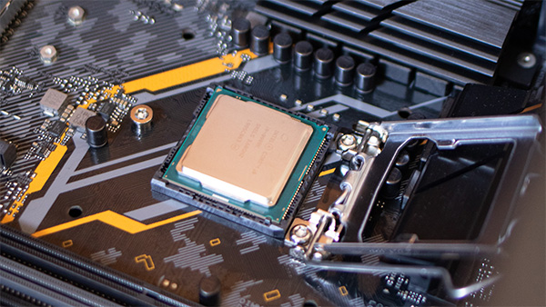

# Datamaskiner

I de siste årene har antallet datamaskiner i verden skutt i været.
Du har kanskje latt merke til at hverdagslige ting får betegnelsen smart foran seg.
For eksempel smart-hus, smart-tv, smart-klokke, smart-kjøleskap, smart-lys, smart-badevekt, smart-brille også videre.
Felles for disse såkalt smarte tingene er at de har en eller annen form for datamaskin i seg.
De konverterer digitale signaler (strøm av eller på) til og fra tall, tekst, bilder, instruksjoner eller noe annet som vi mennesker kan forstå.

I IT1 skal vi holde oss til *vanlige* datamaskiner, altså PC-er og smarttelefoner.

## Deler i en datamaskin

Selv om PC-er og smarttelefoner ser ganske forskjellige ut, er de ganske like på innsiden.
De består av de samme hoveddelene, alle smarttelefoner og PC-er har et hovedkort, en prosessor, et arbeidsminne og et lagringsmedium.

### Hovedkort



Hovedkortet er den delen som kobler alle de andre delene av datamaskinen sammen.
Det fordeler strøm, tar i mot og sender signaler mellom de andre delene.


### Prosessor



Prosessoren er hjernen i datamaskinen, det er den som utfører alle instruksjonene og beregningene i maskinen.
På engelsk kalles prosessoren for central processing unit (CPU).

### Arbeidsminne

  
> *Bilde av [An-d](https://commons.wikimedia.org/wiki/File:Swissbit_2GB_PC2-5300U-555.jpg), kopirett: [CC BY-SA.30](https://creativecommons.org/licenses/by-sa/3.0/)*

Arbeidsminne i datamaskinen er et midlertidig minne, som gjør at datamaskinen raskt kan hente ut data den trenger.
Når du åpner et program på datamaskinen din, lastes alle filene den trenger for å kjøre det programmet inn i arbeidsminne, slik at programmet kan kjøre raskt.

Når vi programmerer programmer bruker vi variabler for å midlertidig lagre verdier, og disse variablene lagres i datamaskinens arbeidsminne.

I kodesnutten under, vil `konge = Harald` lagres i arbeidsminne, og ligge der helt til vi lukker programmet.

```python
konge = "Harald"
```

På engelsk kalles arbeidsminne for random access memory (RAM).

### Lagringsmedium

Arbeidsminne er ganske dyrt, og alt som blir lagret der forsvinner når datamaskinen skrus av, derfor har datamaskiner et lagringsmedium for permanent lagring.
I moderne datamaskiner brukes som regel harddisker som lagringsmedium, og det er på harddisken filene dine ligger lagret permanent.
Før i tiden kunne datamaskiner bruke andre typer lagringsmedium som for eksempel disketter.

Hvis du f.eks lagrer et word-dokument på PC-en din, da lagres det på harddisken.
Når du åpner dokumentet i word igjen, lastes det inn i arbeidsminne.
Hele tiden mens du har dokumentet åpent og endrer på det, ligger det i arbeidsminne.
Først når du trykker lagre, oppdateres dokumentet på harddisken.

På engelsk skilles det mellom hard disk drive (HDD) og solid state drive (SSD), avhengig av hvilken teknologi som brukes, mens vi i Norge ofte bare sier harddisk.

:::tip

Lag et nettsted som forklarer hvilke komponenter som er i en datamaskin og hvordan de fungerer. 
Nettstedet skal ha bilder og info om:
- Harddisk
- Prosessor (CPU)		
- Grafikkort (GPU)		
- Nettverkskort		
- Minne (RAM)		
- Hovedkort

:::
