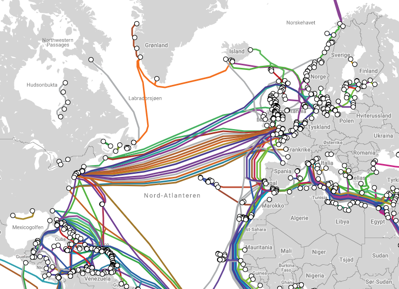

# Internett

Internett er et nettverk som kobler sammen veldig mange datamaskiner over hele verden.
Det består av fysisk infrastruktur, blant annet kabler, satelitter, mobiltårn og datamaskiner.

*Kart over undersjøiske interkabler. Hentet fra [https://www.submarinecablemap.com/](https://www.submarinecablemap.com/).*

## Hvordan?

I 2018 estimerte selskapet Statista at 22 milliarder datamaskiner var koblet på internett. Dette tallet inkluderer kjøleskap, klokker, biler, *vanlige* datamaskiner og mye mer.
Felles for alt som er koblet på internett er at de har et nettverkskort, som lar de kommunisere med andre datamaskiner som er koblet på internett.

Når en datamaskin skal sende en beskjed til en annen datamaskin via internett, konverteres først beskjeden om til en samling av `0` og `1`.
Deretter deles samlingen av `0` og `1` opp i mange mindre *pakker*.
Pakkene sendes hver for seg over det fysiske nettet.
De går gjennom kabler, innom mobiltårn eller andre deler av det fysiske nettet.
På sin vei over nettet er de innom mange datamaskiner, som tar i mot pakkene, og sender de videre i retning målet.
Datamaskinene forsøker å sende pakkene videre den raskeste veien til målet.
Som oftest tar ikke alle pakkene i en beskjed samme vei gjennom nettet.
Det som er den raskeste veien i det ene øyeblikket, er ikke nødvendigvis den raskeste to millisekunder senere.
Til slutt ender pakkene opp hos mottakeren, som setter pakkene sammen til den fullstendige samlingen av `0` og `1`, deretter konverterer den samlingen av `0` og `1` til beskjeden som ble sendt.

## Protokoller

Internett er et veldig stort nettverk, som datamaskiner rundt hele verden er koblet til.
For at det skal fungere må alle følge samme regler for hvordan man skal bruke det.
Derfor har man utviklet en rekke protokoller for hvordan datamaskiner skal bruke nettet.

### IP (Internettprotokollen)

Alle datamaskiner som er koblet på internett har en adresse, dette kalles IP-adressen.
Det er en unik adresse som gjør at vi kan sende beskjeder til riktig datamaskin.

### DNS (Domain name service)

Datamaskinen hvor HTML-filene til VGs nettsider ligger har IP-adressen [195.88.55.16](http://195.88.55.16).
Hvis du skriver inn den IP-adressen i adressefeltet på nettleseren din, kommer du til vg.no.
Alle nettsider på internett kan nås fra en IP-adresse, Google.com for eksempel har adressen [142.250.74.110](http://142.250.74.110).

I starten av internett var IP-adressen man brukte for å kommunisere mellom datamaskiner.
Etterhvert fant de ut at det var litt tungvint å huske IP-adressene til datamaskinene de skulle kommunisere med, derfor lagde man på 80-tallet en protokoll for hvordan man kan bruke *domenenavn*, slik som `vg.no` i stedet for IP-adresser.
Denne protokollen kalles DNS, og gjør det mulig å bruke oppslagsverk som oversetter *domenenavn* til IP-adresser.

Når du skriver `vg.no` i nettleseren din og trykker enter, går datamaskinen din inn et DNS-oppslagsverk og finner IP-adressen til datamaskinen hvor VGs nettsider ligger.
Deretter sender datamaskinen din en beskjed til VGs datamaskin hvor den spør om å få HTML-filene til nettsiden.
VGs datamaskin svarer med å sende HTML-filen tilbake til din datamaskin, som viser nettsiden i nettleseren din.

### TCP (Transmission Control Protocol)

TCP er protokollen som bestemmer hvordan kommunikasjon mellom to datamaskiner skal skje.
Det er den som bestemmer at en beskjed skal deles opp i mindre pakker, og hvordan pakkene skal settes sammen igjen når de kommer frem.

### HTTP (HyperText Transfer Protocol)

HTTP er protokollen brukes av nettlesere på datamaskiner, og bestemmer hvordan HTML-filer skal sendes og mottas.

## Vanlige internett relaterte begreper

Internett er stort, og har mye avansert teknologi, i IT1 får dere bare en liten innføring.
Under er en liste over begreper som brukes mye i dagligtale og er relatert til internett.

|Nettverkskommunikasjon|Forklaring|
|----------------------|----------|
|WLAN|Wireless Local Area Network. Trådløst lokalt nett.|
|Wi-Fi|En standard for tilkobling til et trådløst lokalt nettverk.|
|LAN|Local Area Network. Lokalt nettverk som bruker nettverkskabel til å koble sammen enheter.|
|Ethernet|Nettverksprotokoll for kommunikasjon mellom enheter i et LAN|
|Mobilnett (3G/4G/5G)|Tradløs tilkobling til en leverandørs sender/mottaker som er koblet til internett|
