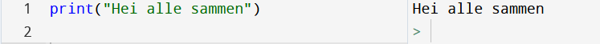

# Hva er programmering?

Programmering handler i bunn og grunn om å gi datamaskinen instruksjoner som den kan gjennomføre. Disse instruksjonene må til syvende og sist ende opp i maskinspråk, altså en lang rekke med 0-ere og 1-ere, men det er veldig få som jobber på det nivået. Det er langt mer normalt å jobbe på et *høyere nivå* og så bruke en *kompilator* (eng: compiler) eller *tolk* (eng: interpreter) for å oversette det vi skriver til maskinspråk. Her finnes det veldig mange mulige løsninger, men det gjelder uansett å skrive riktig slik at det kan oversettes. Derfor er det slik at når vi velger oss et *programmeringsspråk*, må vi følge logikken til de som har laget det. Vi må med andre ord vite hvilke instrukser vi kan gi, og hvordan vi skriver de.

I valget av programmeringsspråk må vi som regel balansere behovet for å ha fullstendig kontroll over hva som skjer med systemet, opp i mot hvor lett språket er å jobbe med. I utdanningsformål fokuserer vi hardt på sistnevnte, og derfor faller valget på **Python**.

Selv om det finnes mange ulike programmeringsspråk på ulike nivå der ute, er de grunnleggende prinsippene egentlig ganske like. Det betyr at dersom du etterhvert behersker Python, vil det være langt lettere å lære seg ett annet språk ved en senere anledning!


# Hvordan komme igang?

Når vi nå har valgt oss et språk, trenger vi et såkalt *IDE* (Integrated Development Environment), altså en applikasjon som hjelper oss med å skrive, rette opp og utføre kode. Igjen finnes det mange valg! Her på skolen har du muligens allerede brukt Anaconda, men VS Code fungerer også fint med riktige utvidelser og instillinger (hør med læreren din).

Med det grunnleggende på plass kan vi nå begynne å programmere. Vi bruker Python til å gi datamaskinen følgende instruksjon:



*Vi skrev koden på venstre del, og ser resultatet på høyre side*

For å få samme resultat må vi skrive koden på nøyaktig samme måte. Dersom du prøver å endre på noe annet en selve teksten inne i anførselstegnene får du en feilmelding. Det gjelder både om du endrer fra små til store bokstaver eller om du prøver å fjerne anførselstegn eller parenteser. I motsetning til virkeligheten der en instruksjon kan formuleres på mange forskjellige måter uten at meningen går tapt, må vi følge strenge regler når vi programmerer. En stor del av det vi skal jobbe videre med er å forstå logikken bak koden vi skriver og reglene som gjelder. 

`print`-instruksen skriver altså ut en melding når programmet kjøres. Denne er viktig for oss i begynnelsen fordi det først og fremst er slik brukeren skal "kommunisere" med koden vår. I virkeligheten gjøres slikt stort sett i form av en såkalt *UI* (User Interface) eller *GUI* (Graphical User Interface). Tenk for eksempel på menyvalgene og knappene du kan bruke når du skriver i Word eller skal betale med Vipps. Den slags interaksjon er alt for vanskelig når man skal lære seg grunnleggende programmering, dermed bruker vi i dette kapittelet `print()` for alle meldinger programmet vårt skal skrive ut.

Prøv deg litt frem og print ut ulike beskjeder. Prøv for eksempel å skrive ut følgende:

```python
print("2+2")
print(2+2)
```

Her fungerte det plutselig å printe en beskjed uten å bruke anførselstegn. I tillegg ser det ut til at programmet faktisk regnet ut summen for oss. Hvorfor det er slik, skal vi se nærmere på i neste delkapittel der vi skal jobbe med datatyper og variabler. 
