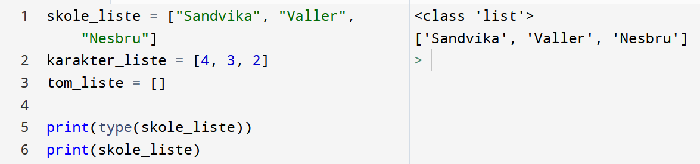
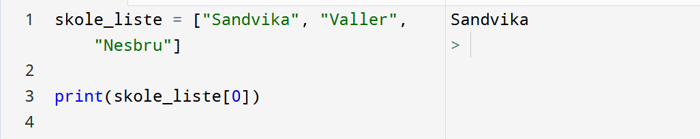

# Lister

Når vi skal utnytte datamaskinens evnte til å håndtere store mengder informasjon veldig raskt trenger vi muligheten til å lagre og gruppere informasjon sammen på en god måte. Da er *lister* og *ordbøker* (eng: *dictionaries*) gode verktøy, og derfor en ny type variabel vi skal lære å håndtere i dette kapittelet. Vi må da se på hvordan vi oppretter slike variabler, hvordan vi kan hente all eller spesifikk informasjon og hvordan vi enkelt kan endre eksisterende informasjon. I tillegg skal vi se nærmere en del eksempler der vi kombinerer løkker med lister for å få til en del litt mer avansert interaksjon.

## Opprette lister

La oss starte enkelt ved å opprette et par lister. Vi starter som en hvilken som helst annen variabel ved å bestemme oss for et navn og så deklarere med likhetstegnet:

```python
skole_liste = ["Sandvika", "Valler", "Nesbru"]
karakter_liste = [4, 3, 2]
tom_liste = []
```

Vi ser at det er klammeparentesene som forteller python at vi har laget ei liste. Selve liste-elementene separeres med komma. Som vi kan se av eksempelet kan vi lagre informasjon i form av både tall og strenger (vi kan også blande typer i en og samme liste). La oss undersøke våre nyopprettede variabler ved å printe de ut, samt sjekke hva slags type de er lagret som:



Som forventet er variabelen registrert av typen liste, og når vi printer den ut får vi hele listen. Neste steg er da å se nærmere på hvordan vi kan hente ut deler av listen. 

## Element i lister

La oss se nærmere på listen over skoler: `["Sandvika", "Valler", "Nesbru"]`. En slik liste er *ordnet*, det vil si at rekkefølgen vi har lagret skolene er en del av listen. Dermed vet vi at Sandvika ligger først i listen, mens Nesbru ligger sist (uten at det har noe mer å si akkurat nå). I dette tilfellet sier vi at Sandvika ligger på plass nummer 0, Valler ligger på plass nummer 1 og Nesbru på plass nr 2. Det er tre element i lista, men vi teller alltid fra 0 når vi skal angi hvilken plass et element ligger på:

| skole_liste | `"Sandvika"` | `"Valler"` | `"Nesbru"` |
| ----------- | ------------ | ---------- | ---------- |
| indeks      | 0            | 1          | 2          |

Dette betyr at dersom vi skal hente ut Sandvika, så må vi huske at det ligger først, altså på plass null! Vi skriver følgende:





Tilsvarende kan vi hente ut de andre skolene dersom det trengs. Pass på at dersom du glemmer deg og prøver å hente ut element nr 3, så får du en feil. Datamaskinen prøver å finne det fjerde elementet i lista, men det finnes jo bare tre.


## Oppsummering

| Metode / Operasjon               | Resultat                                       | Beskrivelse                                       |
| -------------------------------- | ---------------------------------------------- | ------------------------------------------------- |
| `skole_liste[1]`                 | `"Valler"`                                     | Hent ut det som ligger på indeks `1`              |
| `skole_liste[2] = "Stabekk" `    | `["Sandvika", "Valler", "Stabekk"]`            | Sett det som ligger på indeks `2` til `"Stabekk"` |
| `skole_liste[-1]`                | `"Nesbru"`                                     | Hent ut det som ligger `-1` fra slutten av listen |
| `skole_liste[-2]`                | `"Valler"`                                     | Hent ut det som ligger `-2` fra slutten av listen |
| `len(skole_liste)`               | `3`                                            | Lengden av listen                                 |
| `skole_liste + karakter_liste`   | `["Sandvika", "Valler", "Stabekk", 4, 3, 2]`   | Slå sammen lister                                 |
| `"Valler" in skole_liste`        | `True`                                         | Sjekk om noe er i listen                          |
| `"Nesbru" not in skole_liste`    | `False`                                        | Sjekk om noe ikke er i listen                     |
| `skole_liste.index("Sandvika")`  | `0`                                            | Finn plassering til noe i listen                  |
| `skole_liste.append("Stabekk")`  | `["Sandvika", "Valler", "Nesbru", "Stabekk"]`  | Legg noe til på slutten av listen                 |
| `skole_liste.insert(1, "Rud")`   | `["Sandvika", "Rud", "Valler", "Nesbru"]`      | Sett noe inn i listen på en gitt indeks           |
| `skole_liste.remove("Valler")`   | `["Sandvika", "Nesbru"]`                       | Fjern noe fra listen                              |
| `skole_liste.pop(2)`             | `["Sandvika", "Valler"]`                       | Fjern det som ligger på indeks `2` fra listen     |
| `skole_liste.sort()`             | `["Nesbru", "Sandvika", "Valler"]`             | Sorter listen etter ASCII-tabellen                |
| `skole_liste.sort(reverse=True)` | `["Valler", "Sandvika", "Nesbru"]`             | Sorter listen motsatt vei etter ASCII-tabellen    |
| `" og ".join(skole_liste)`       | `"Valler og Sandvika og Nesbru"`               | Slår listen sammen til en tekst                   |
| `",".join(skole_liste)`          | `"Valler,Sandvika,Nesbru"`                     | Slår listen sammen til en tekst                   |

## Oppgaver

### Oppgave 4.1

a) Lag ei liste med navn på fagene du har i år. Alle elementene i lista skal være strenger.

b) Print ut favorittfaget ditt med en tilhørende tekst

c) Legg til noen fag du hadde forrige skoleår i lista

d) Finn lengden av lista uten selv å måtte telle den

<details>
<summary>Klikk for løsning</summary>

```python
fag = ["norsk", "matematikk", "historie", "gym", "informasjonsteknologi", "fysikk", "engelsk"]

print("mitt favorittfag er ", fag[4])

fag.append("naturfag")
fag.append("geografi")
fag.append("samfunnsfag")

print("antall fag:", len(fag))
```

</details>

### Oppgave 4.2

Bruk lista med fag fra oppgave 4.1

Lag en input der brukeren kan skrive inn et fag

Sjekk om faget ligger i lista. Hvis ja skriv at du har faget, hvis nei skriver du ut beskjed om at du ikke har det.

Eksperttips: Dersom variabelen tekst er en streng vil tekst.lower() gjøre om hele teksten til små bokstaver.

<details>
<summary>Klikk for løsning</summary>

```python
fag = ["norsk", "matematikk", "historie", "gym", "informasjonsteknologi", "fysikk", "engelsk"]

sjekk = input("Hvilket fag vil du sjekke? ")

if sjekk in fag:
    print("Jeg kan dette faget!")
else:
    print("Beklager, jeg har ikke hatt", sjekk)
```

</details>

### Oppgave 4.3

a) Lag følgende liste med tall: [1,3,5,6]

b) Legg til tallet 8 på slutten av lista

c) Legg til tallet 4 mellom 3 og 5 i lista

d) Endre tallet 4, slik at det står som “fire” i stedet.

e) Fjern “fire” fra lista

f) Print lengden av lista

<details>
<summary>Klikk for løsning</summary>

```python
tall = [1,3,5,6]
tall.append(8)
tall.insert(2,4)
tall[2] = "fire"
tall.remove("fire")
```

</details>

### Oppgave 4.4

Legg alle julekarakterene inn i ei liste (som tall!)

Bruk `sum(liste)` og `len(liste)` til å regne gjennomsnittet. Rund av til to desimaler.

Print en passende tekst

Finn på et passende snitt til en utdanning du vil søke på. Sjekk om du kommer inn eller ikke. Print ut en passende tekst

<details>
<summary>Klikk for løsning</summary>

```python
karakterer = [4,4,5,5,3,6,5,4,3,2,4,3] # Tilfeldig både mhp karakter og antall fag

snitt = sum(karakterer)/len(karakterer)

print("Mitt karaktersnitt er:", snitt)

if snitt > 4.8:
    print("Hurra, jeg kommer inn")
else:
    print("Jeg må nok forbedre karakterene mine")
```

</details>

### Oppgave 4.5

Norske bilnummer har to (store) bokstaver og fem tall.

Du skal lage et program der man enten kan legge til eller sjekke et bilnummer.

Legg en while-løkke rundt programmet så det gjentar seg. Enten ved å sette `while True:` eller ved å spørre om brukeren vil fortsette.

Lag en liste der du legger inn noen få fiktive bilnummer.

Spør først brukeren om de vil legge til eller sjekke et nummer. 

Hvis de vil legge til, ta inn det nye nummeret og legg det i lista.

Hvis de vil sjekke, ta inn nummeret og sjekk om det ligger i lista. Skriv ut en passende tekst.

<details>
<summary>Klikk for hint</summary>

- Lag ei liste, enten tom eller med noen tilfeldige bilnummer du selv fyller inn
- Lag en input der du spør etter en bokstav for å legge til eller sjekke nr
- Lag en betingelse der du tester bokstaven fra input.
- Skriv kode for å hendholdsvis legge til eller sjekke i riktig sted i betingelsen

</details>

<details>
<summary>Klikk for løsning</summary>

```python 
bilskilt = ["AB12345", "BT12345"]
fortsett = "ja"

while fortsett.lower() == "ja":
    valg = input("Vil du (S)jekke eller (L)egge til et nummer? ")
    if valg.upper() == "S":
        nummer = input("Skriv inn nummeret du vil sjekke: ")
        if nummer in bilskilt:
            print("Nummeret finnes registrert")
        else:
            print("Nummeret finnes ikke i vårt register")
    elif valg.upper() == "L":
        nummer = input("Skriv inn nummeret du vil legge til: ")
        bilskilt.append(nummer)
    else:
        print("Du må velge S eller L!")
    fortsett = input("Vil du fortsette (ja/nei)?")
```

</details>

### Oppgave 4.6

Opprett en liste `mineTall` med tallene 9, 3, 1 og 2.

- Bruk liste-metoder for å endre listeen til å bare inneholde tallene 3 og 1. 
- Legg til tallet 2 mellom tallene 3 og 1. 
- Legg til stringen “Stilig” på indeks 3 og boolean-en true på indeks 5. 
- To-dimensjonal liste, gjør følgende: 
- Lag en liste 
- Lag tre nye lister inne i listen 
- Legg til tallene 1, 2, 3 i den første listen 
- Legg til tallene 4, 5, 6 i den andre listen 
- Legg til tallene 7, 8, 9 i den tredje listen 
- Skriv ut tallene 1, 3, 5 og 9 fra listen 

<details>
<summary>Klikk for løsning</summary>

```python
mineTall = [9, 3, 1, 2]
mineTall.remove(9)
mineTall.remove(2)
mineTall.insert(1, 2) # sett inn 2 på indeks 1
mineTall.insert(3, "stilig")
mineTall.insert(5, True)
print(mineTall)

liste2d = [
    [1, 2, 3], 
    [4, 5, 6], 
    [7, 8, 9]
]

print(liste2d[0][0], liste2d[0][2], liste2d[1][1], liste2d[2][2])
```

</details>

### Oppgave 4.7

Lag en ordbok med info om den du sitter ved siden av. 

Print navn og alder fra ordboken. 

<details>
<summary>Klikk for hint</summary>

Koden under lager en ordbok med navnet `bil` og egenskapene `merke` og `farge`.
```python
bil = {
    "merke": "Ferrari",
    "farge": "Rød"
}
```

</details>

<details>
<summary>Klikk for løsning</summary>

```python
person = {
    "navn": "Ola Nordmann",
    "alder": 22
}

print(person["navn"], "er", person["alder"], "år gammel.")
```

</details>

### Oppgave 4.8

Ordboken under har navn på land som egenskaper og fargene på flagget til landene som verdier. 

```python
flagg = { 
    "norge": ["rødt", "hvitt", "blått"], 
    "sverige": ["blått", "gult"], 
    "danmark": ["rødt", "hvitt"], 
    "finland": ["hvitt", "blått"], 
    "japan": ["rødt", "hvitt"], 
    "gabon": ["grønt", "gult", "blått"], 
    "chile": ["blått", "hvitt", "rødt"] 
}
```

:::caution

Merk at vi kan skrive ordbøker og lister over flere linjer, så lenge vi passer på komma og avsluttende `]` eller `}`, som i flagg over. 

:::

Bruk `flagg["egenskap"]`, og legg til et nytt land i ordboken.

Legg til kode slik at brukeren kan skrive inn et land, og så printes fargene til landets flagg. Hvis brukeren skriver inn et land som ikke eksisterer i ordboken, skal programmet gi en feilmelding som forteller at vi ikke har lagret info om dette landet.

<details>
<summary>Klikk for løsning</summary>

```python
flagg = { 
    "norge": ["rødt", "hvitt", "blått"], 
    "sverige": ["blått", "gult"], 
    "danmark": ["rødt", "hvitt"], 
    "finland": ["hvitt", "blått"], 
    "japan": ["rødt", "hvitt"], 
    "gabon": ["grønt", "gult", "blått"], 
    "chile": ["blått", "hvitt", "rødt"] 
}

flagg["polen"] = ["hvitt", "rødt"]

land = input("Skriv inn et land du tenker på: ").lower()

if flagg[land]:
    # Definerer en variabel som setter sammen alle fargene og separerer disse med komma.
    farger = ", ".join(flagg[land])
    print(f"Landet har fargene {farger}.")
else:
    print("Vi har dessverre ikke fargene til flagget til dette landet!")
```

</details>

### Oppgave 4.9

a) Lag en liste `bakeri`, og fyll listen med følgende varer som ordbøker, hvor navn og pris er nøkler. 

- Croissant: 25 kr
- Grovbrød: 40 kr
- Kneipp: 20 kr
- Rosinbolle: 20 kr
- Baguette: 10 kr

Print innholdet i hele `bakeri`-et som en meny med en linje per vare, med navn og pris.

> Tips: bruk en for-løkke

b) Øk prisen på croissant med 10 kr, uten å endre hva du skrev i din originale liste.

Skriv ut listen med innhold på nytt, og sjekk at croissantens pris er endret riktig.

c) Lag en funksjon meny(liste) som du kan kalle på for å utføre oppgave 1 og 4, og endre programmet ditt til å kjøre denne funksjonen i stedet.

<details>
<summary>Klikk for løsning</summary>

a)
```python
meny = [
    {
        "navn": "Croissant",
        "pris": 25
    },
    {
        "navn": "Grovbrød",
        "pris": 40
    },
    {
        "navn": "Kneipp",
        "pris": 20
    },
    {
        "navn": "Rosinbolle",
        "pris": 20
    },
    {
        "navn": "Baguette",
        "pris": 10
    }
]

for produkt in meny:
    print(f"{produkt['navn']} koster {produkt['pris']} kr.")
```

b)
Legg til følgende linje av kode før for-løkken i oppgave a).

```python
meny[0]["pris"] = 35
```

c)

Kommer...

</details>
