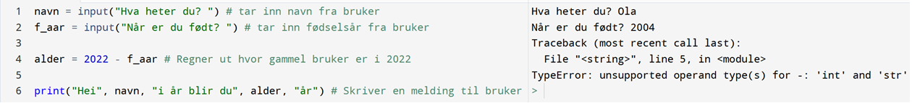

# Variabler


*På samme måte som med denne hylla med kjemiske stoffer, kan vi lagre mye forskjellig i datamaskinens minne.*

En av de viktigste prinsippene når vi skal kode, er at vi kan lagre alt mulig i datamaskinens minne. Det vi lagrer kan vi hente opp igjen i koden, og bruke når vi selv ønsker det. Når vi lagrer noe i datamaskinens minne på denne måten kaller vi det for en *variabel*. God bruk av variable er fundamentalt for å lære seg å programmere godt. Akkurat som med glassene i bildet over, kan vi lagre alt mulig rart; bokstaver, setninger, tall og lister er eksempler på variabler som ofte brukes. Som vi ser i bildet over er det lurt å ha gode merkelapper på glassene. I den digitale verden må vi på samme måte også være påpasselige å si nøyaktig hva vi lagrer, slik at datamaskinen har riktig oversikt. Da vil vi samtidig også være i stand til å hente frem riktig variabel når vi trenger den. 

## Lagre en variabel
Dersom vi for eksempel ønsker å lagre tallet 10 skriver vi:

```python
tall = 10
```

Navnet på variabelen (i dette tilfellet `tall`) tilsvarer merkelappen til krydderhylla. Selv om vi bestemmer navnet selv, bør vi velge et navn som gir mening.

## Hente en variabel

Når vi har lagret en variabel kan vi hente den ved å bruke navnet (merkelappen) vi satte på den:

```python
tall = 10
print(tall)
```
Hva tror du skrives til konsollen? Sjekk selv.


## Datatyper

Som nevnt kan vi lagre veldig mye forskjellig som variabler, men datamaskinen vet i utgangspunktet ikke forskjell på noen av delene. Skal for eksempel `2` være ett tall som vi skal bruke til å regne med, eller skal det bare være en del av en vanlig tekst? For at programmet skal fungere er det viktig at vi vet hvilken *datatype* vi jobber med. Det betyr at når vi *deklarer*/lager en ny variabel, så må vi ikke bare lage et navn og innhold på den. Vi må samtidig fortelle hva slags type variabel det er. I mange andre programmeringsspråk gjøres dette spesifikt, men i Python holder det å skrive på en spesiell form for at programmet skal gjenkjenne datatypen. La oss se nærmere på nøyaktig hva vi skal skrive for å skille mellom ulike datatyper.

### Strenger (eng: String)

Med strenger tenker vi som regel på all tekst, men en streng er i bunn og grunn en kombinasjon av bokstaver, symboler og tall vi kan skrive med tastaturet. En streng må skrives med anførselstegn rundt. Dermed har vi litt bedre forståelse av instruksjonen fra forrige kapittel:

```python
print("Hei alle sammen!")
```

Setningen vi ville skrive ut er en streng, og må dermed være i anførselstegn. Dersom vi ikke har de med vil datamaskinen lete etter en variabel ved navn `Hei` som ikke finnes og gi en feilmelding.

### Tall

Når vi jobber med tall holder det å skrive tallet (uten anførselstegn). Python har også de fire regneartene innebygd:

```python
tall1 = 10
tall2 = 4.2
print(tall1 + tall2)
```

*Hva printes ut her?*

Fra tidligere vet du at man relativt greit kan regne om heltall til totallsystemet og omvendt. For desimaltall blir konverteringen til bytes vanskeligere (og utenfor pensum). Vi har likevel fått det til, og dermed har vi to forskjellige datatyper for tall. Disse kalles *heltall* (fra eng. *integer*) og *flyt-tall* (fra eng. *float*). I praksis er det ikke så mye forskjell for vår del, men det kan dukke opp feil der man for eksempel prøver å behandle et heltall som om det var et desimaltall. I matematikken ville det vært uproblematisk, men når vi koder må vi være klar over forskjellen.

### Input

Dette er egentlig en streng, men den har en spesiell form og brukes masse for å lage interaksjon med brukeren av programmet (før vi gjør det med grafikk).

```python
navn = input("Hva heter du? ")
```

Når vi kjører programmet vil du se at spørsmålet stilles i konsollen. Programmet fortsetter ikke før vi har svart på spørsmålet. Svaret vårt lagres som en streng i variabelen navn:


:::caution

Alle verdier som en bruker skriver inn når `input()` blir brukt, er lagret som en strenge.

Vi kan gjøre om formen til for eksempel et tall om det trengs; dette ser vi på [under](#konvertere-datatyper).

:::

### Boolske variable

```python
test = True
```

En slik variabel kan kun ha verdiene `True` eller `False`. Tenk på den som en bryter som kun kan være av eller på. Vi bruker den ikke så ofte, men det er en del av betingelser som vi skal se på senere.

### Lister

```python
liste = ["eple", "banan", "appelsin"]
```

Dette er mer avanserte datatyper som vi skal se på i et eget kapittel. Vi kan for eksempel samle data, tall og/eller egenskaper i lister, og de har mange verktøy for å jobbe videre med de.

### Printe flere variable

Vi kan printe ut flere variable, sammen med tekst ved å kjede sammen alt med komma mellom hver gang:

```python
navn = input("Hva heter du? ")
sted = input("Hvor gammel er du?" )

print("Hei", navn, "hyggelig å hilse på deg. Du er", alder, "år gammel")
```

## Konvertere datatyper 

Se på følgende kode:



Her får vi en feilmelding som går på datatyper. Du husker kanskje at alle input-variable lagres som strenger? Når vi skal regne ut alderen så prøver vi å regne med 2022 og tallet brukeren skrev. Python kjenner igjen det som kom fra input-feltet som en streng, og kan derfor ikke regne seg frem til et svar. Vi må derfor *konvertere* fødselsåret som vi får fra input-feltet fra streng til tall. Siden vi skal regne på årstall, er det beste å konvertere til heltall. Vi konverter på følgende måte:


På linje 2 i koden ser du at vi har lagt `int()` rundt input-feltet. Det er en instruksjon som konverterer om til tall dersom det gir mening. Nå er det kun tall som håndteres i linje 4, og koden vil fungere. I følgende tabell ser du kodeinstruksjonene for å konvertere mellom ulike datatyper (forutsatt at det gir mening).

| Navn | Skrivemåte | Datatype |
|----------|------------|-----------|
| streng | x = "skriv tekst og tall"  | str |
| heltall  | x = 10        | int |
| desimaltall| x = 10.0    | float |
| boolsk | x = True / x = False | bool |
| liste | x = [1,2,"eple"] | list |
| ordbok| x = {eple: 2, banan: 3} | dict |

*Her ser du en tabell ulike datatyper og hvordan vi skriver de.*
