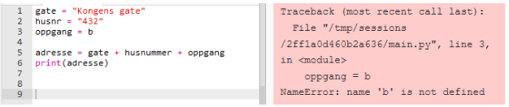

# Variabler


*Når vi programmerer kan vi også sortere og lagre mye forskjellig i datamaskinens minne.*

En av de viktigste prinsippene når vi skal kode, er at vi kan lagre alt mulig i datamaskinens minne. Det vi lagrer kan vi hente opp igjen i koden, og bruke når vi selv ønsker det. Når vi lagrer noe i datamaskinens minne på denne måten kaller vi det for en **variabel**. God bruk av variable er fundamentalt for å lære seg å programmere godt. Vi kan lagre alt mulig rart; bokstaver, setninger, tall og lister er eksempler på variabler som ofte brukes. Som vi ser i bildet over er det lurt å ha gode merkelapper for å holde oversikten. I den digitale verden må vi på samme måte også være påpasselige å si nøyaktig hva vi lagrer. Da vil vi være lettere i stand til å hente frem riktig variabel når vi trenger den. 

## Lagre en variabel
Dersom vi for eksempel ønsker å lagre tallet 10 kan vi skrive:

```python
tall = 10
```

Vi sier at vi **deklarerer** variabelen `tall` med verdien `10`. Navnet på variabelen tilsvarer merkelappen på glassene i hylla. Selv om vi bestemmer navnet selv, bør vi velge et navn som gir mening. Dersom vi senere overskriver verdien vi lagrer i tall, er det alltid den siste deklarasjonen som gjelder.

## Hente en variabel

Når vi har lagret en variabel kan vi hente den ved å bruke navnet (merkelappen) vi satte på den:

```python
tall = 10
print(tall)
```
Hva tror du skrives til konsollen? Sjekk selv.


## Datatyper

Som nevnt kan vi lagre veldig mye forskjellig som variabler, men datamaskinen vet i utgangspunktet ikke forskjell på noen av delene. Skal for eksempel verdien `10` være ett tall som vi skal bruke til å regne med, eller skal det bare være en del av en vanlig tekst? For at programmet skal fungere er det viktig at vi vet hvilken *datatype* vi jobber med. Det betyr at når vi deklarerer en ny variabel, så må vi ikke bare lage et navn og innhold på den. Vi må samtidig fortelle hva slags type variabel det er. I mange programmeringsspråk gjøres dette spesifikt, men i Python holder det å skrive verdien av variabelen på riktig form form for at programmet skal gjenkjenne datatypen. La oss se nærmere på nøyaktig hva vi skal skrive for å skille mellom ulike datatyper.

##### Strenger (eng: String)

Med strenger tenker vi som regel på all tekst, men en streng er i bunn og grunn en kombinasjon av bokstaver, symboler og tall vi kan skrive med tastaturet. En streng må skrives med anførselstegn rundt. Dermed har vi litt bedre forståelse av instruksjonen fra forrige kapittel:

```python
print("Hei alle sammen!")
```

Setningen vi ville skrive ut er en streng, og må dermed være i anførselstegn. Dersom vi ikke har de med vil datamaskinen lete etter en variabel ved navn `Hei` som ikke finnes og gi en feilmelding.

##### Tall (int og float)

Når vi jobber med tall holder det å skrive tallet (uten anførselstegn). Python har også de fire regneartene innebygd:

```python
tall1 = 10
tall2 = 4.2
print(tall1 + tall2)
```

*Hva printes ut her?*

Fra tidligere vet du at man relativt greit kan regne om heltall til totallsystemet og omvendt. For desimaltall blir konverteringen til bytes vanskeligere (og utenfor pensum). Vi har likevel fått det til, og dermed har vi to forskjellige datatyper for tall. Disse kalles *heltall* (fra eng. *integer*) og *flyt-tall* (fra eng. *float*). I praksis er det ikke så mye forskjell for vår del, men det kan dukke opp feil der man for eksempel prøver å behandle et heltall som om det var et desimaltall. I matematikken ville det vært uproblematisk, men når vi koder må vi være klar over forskjellen.

##### Input

Dette er egentlig en streng, men den har en spesiell form og vi bruker den for interaksjon med brukeren av programmet.

```python
navn = input("Hva heter du? ")
```

Når vi kjører programmet vil du se at spørsmålet stilles i konsollen. Programmet fortsetter ikke før vi har svart på spørsmålet. Svaret vårt lagres som en streng i variabelen navn:


:::caution

Alle verdier som en bruker skriver inn når `input()` blir brukt, er lagret som en streng.

Vi kan gjøre om formen til for eksempel et tall om det trengs; dette ser vi på [senere](#konvertere-datatyper) i kapittelet.

:::

#### Boolske variable

```python
test = True
```

Boolske variable kan kun ha verdiene `True` eller `False`. Tenk på de som en bryter som kun kan være av eller på. Vi bruker de ikke så ofte i IT-1, men konseptet en blant annet del av `betingelser` som vi skal se på senere.

#### Lister

```python
liste = ["eple", "banan", "appelsin"]
```

Dette er mer avanserte datatyper som vi skal se på i et eget kapittel. Vi kan for eksempel samle data, tall og/eller egenskaper i lister, og har mange muligheter for å jobbe videre med de.

#### Printe flere variable

Vi kan printe ut flere variable, sammen med tekst ved å kjede sammen alt med komma mellom hver gang:

```python
navn = input("Hva heter du? ")
sted = input("Hvor gammel er du? ")

print("Hei", navn, "hyggelig å hilse på deg. Du er", alder, "år gammel")
```

## Konvertere datatyper 

Se på følgende kode:


Her får vi en feilmelding som går på datatyper. Du husker kanskje at alle input-variable lagres som strenger? Når vi skal regne ut alderen så prøver vi å regne med 2022 og tallet brukeren skrev. Python kjenner igjen det som kom fra input-feltet som en streng, og kan derfor ikke regne seg frem til et svar. Vi må derfor *konvertere* fødselsåret som vi får fra input-feltet fra streng til tall. Siden vi skal regne på årstall, er det beste å konvertere til heltall. Vi konverter på følgende måte:


På linje 2 i koden ser du at vi har lagt `int()` rundt input-feltet. Det er en instruksjon som konverterer om til tall dersom det gir mening. Nå er det kun tall som håndteres i linje 4, og koden vil fungere. I følgende tabell ser du kodeinstruksjonene for å konvertere mellom ulike datatyper (forutsatt at det gir mening).

| Navn | Skrivemåte | Datatype |
|----------|------------|-----------|
| streng | x = "skriv tekst og tall"  | str |
| heltall  | x = 10        | int |
| desimaltall| x = 10.0    | float |
| boolsk | x = True / x = False | bool |
| liste | x = [1,2,"eple"] | list |
| ordbok| x = {eple: 2, banan: 3} | dict |

*Her ser du en tabell ulike datatyper og hvordan vi skriver de.*

## Nyttig bonus: Formatering av strenger

Formatering av strenger går ut på å sette inn verdier inn i strenger, eller å sette sammen flere strenger (*konkatenering*).
Dette blir ofte brukt for å vise informasjon, feilmeldinger, eller annet viktig brukeren bør vite.

Et typisk eksempel kan være å printe ut informasjon om brukeren. Man lærer ofte å gjøre det slik:
```python
navn = input("Hva heter du? ")
alder = input("Hvor gammel er du? ")
kommentar = "Du er veldig kul"

print("Hei", navn + ", du er", alder, "år gammel.", kommentar + "!")
```

Legg merke til at vi bytter mellom å bruke `,` og `+`, fordi komma vil sette inn et mellomrom i teksten som blir skrevet ut, mens pluss vil ikke gjøre dette.
Denne måten å sette sammen strenger på kan bli veldig vanskelig å holde styr på etter hvert, og derfor har vi flere måter å formatere strenger på i Python.

:::note

Hvilken måte du velger å gjøre det på, er opp til deg - likevel er f-strings generelt sett anbefalt.

:::

### Anbefalt: Formatering med f-strings

En f-string er nesten identisk sammenlignet med en vanlig strenge, men den har en vesentlig forskjell - den lar oss sette inn variabler og annet info veldig enkelt.

For å lage en f-string, bruk bokstaven `f` rett før strengen, og sett inn variablene du ønsker slik:
```python
navn = input("Hva heter du? ")
alder = input("Hvor gammel er du? ")
kommentar = "Du er veldig kul"

print(f"Hei {navn}, du er {alder} år gammel. {kommentar}!")
```

### Formatering med format-funksjonen

Et annet alterativ for å formatere strengene våre er å bruke `format`-funksjonen slik:
```python
navn = input("Hva heter du? ")
alder = input("Hvor gammel er du? ")
kommentar = "Du er veldig kul"

print("Hei {}, du er {} år gammel. {}!".format(navn, alder, kommentar))
```

Denne funksjonen er innebygd, og alle strenger har den tilgjengelig.

## Oppgaver

### Oppgave 1.1

Print ut noen selvvalgte beskjeder. Prøv å se hva som skjer dersom du glemmer anførselstegnene.

### Oppgave 1.2 

a) Hva tror du skjer dersom vi kjører følgende kode? 

```python
a = 2
print(a + 2)
``` 

b) Hvorfor er det ingen anførselstegn i print-instruksjonen denne gangen?

<details>
    <summary>Klikk for løsning</summary>

Koden printer ut 4. Vi kan ikke bruke anførselstegn fordi det ikke er en streng vi skal printe ut.

</details>

### Oppgave 1.3

Se på følgende kode:

```python
lengde = 5
bredde = 7

areal = lengde*bredde

print("Arealet av rektangelet er", areal)
```
Hvorfor bruker vi variable for lengde og bredde? Kunne vi ikke bare ha skrevet arealet rett inn i print-funksjonen?

<details>
<summary>Klikk for løsning</summary>

Variabler gir bedre oversikt når man leser koden. Dersom man ønsker å regne areal for et annet rektangel er det mye lettere å endre på verdien på variablene enn å gå inn i resten av koden for å endre på tallene. Dette blir spesielt viktig jo større koden er.

</details>

### Oppgave 1.4

Spør den du sitter nærmest om alder. Lagre både navn og alder i to forskjellige variabler. Print en tekst som skriver ut følgende tekst rikig: Hei *navn*, du er *alder* år.

<details>
<summary>Klikk for hint</summary>

Lag et input-felt for navn og alder. Husk komma i mellom strenger og variable når du printer ut.

</details>

<details>
<summary>Klikk for løsning</summary>

```python
navn = input("Hva heter du? ")
alder = input("Hvor gammel er du? ")

print("Hei", navn, "du er", alder, "år")
```

</details>

### Oppgave 1.5

Lag et program som ber om to tall. Programmet skal deretter regne ut differansen mellom de to tallene og skrive ut svaret. Her er et eksempel på hvordan en kjøring av programmet kan se ut:

```
Oppgi verdien til x: 25
Oppgi verdien til y: 19
Differansen mellom x og y er 6.
```

<details>
<summary>Klikk for hint</summary>

Husk at det som bruker skriver inn alltid blir tekst, du må konvertere til flyttall (float) eller heltall (int). Eks: `float(input("Oppgi verdien til x: "))`

</details>

<details>
<summary>Klikk for løsning</summary>

```python
x = float(input("Oppgi verdien til x: "))
y = float(input("Oppgi verdien til y: "))
diff = x - y
print("Differansen mellom x og y er ", diff)
```

</details>

### Oppgave 1.6



a) Forklar hva som er galt med denne koden. Hvorfor blir det feil? Rett opp koden slik at den kjører.

b) Skriv adressen ut på følgende to måter ved å bruke variabler: "Adressen er Kongens gate 432b" og "Gaten er Kongens Gate, husnummeret er 432, oppgang b" 

<details>
<summary>Klikk for løsning</summary>

a) I linje 3 er b skrevet uten anførselstegn. Da leter programmet etter en variabel som heter `b`, som ikke finnes.

b)

```python
gate = "Kongens gate"
husnr = "432"
oppgang = "b"

print("Adressen er", gate + husnummer + oppgang)
print("Gaten er", gate, ", husnummeret er", husnr, "oppgang", oppgang)
```

</details>

### Oppgave 1.7

Du er på restaurant med venner, og på regningen er følgende informasjon:

Total pris for mat og drikke: 850 kr<br />
Ungdomsrabatt: 25 %<br />
Tips: 10 %

a) Legg informasjonen inn i variabler som tall (ikke bruk %, det gir ikke mening når vi programmerer)

b) Bruk variablene for total pris og ungdomsrabatt til å regne ut rabatten.

c) Trekk fra rabatt og bruk så variabelen for tips til å regne ut tips. 

d) Legg på tips, og skriv ut summen for måltidet etter både rabatt og tips 

e) Lag en variabel for antall personer, og skriv ut pris per person samt antall personer.

<details>
<summary>Klikk for hint</summary>
<p>

- Lag de tre variablene
- Husk prosentformlene: pris*rabatt/100 gir selve rabatten
- Lag egne variabler for alle mellomregningen.
- Bruk mellomregningene til å regne ut det som skal betales
- Print ut alle variabler du er usikre på underveis så er det lettere å finne ut om matematikken stemmer

</p>
</details>


<details><summary>Klikk for løsning</summary>

```python
# Her regner vi tips før rabatt, man kan argumentere for at det kan gjøres motsatt

pris = 850
rabatt_prosent = 25
tips = 10
ant_pers = 3

rabatt_kr = pris*rabatt_prosent/100
tips_kr = pris*tips_kr

totalt = pris - rabatt_kr + tips_kr/100
per_pers = totalt/ant_pers

print("Pris etter rabatt og tips er", totalt, "det blir", per_pers, "kr per person")
```

</details>

### Oppgave 1.8

Formelen for å regne Fahrenheit om til Celsius er `C = (F-32)*5/9`. Lag et program som spør brukeren om temperaturen i fahrenheit. Regn om til Celsius og skriv en beskjed som sier hvor mange grader Celsius det tilsvarer. 

<details>
<summary>Klikk for hint</summary>

- Lag en input som tar inn temperatur, husk å gjøre om til desimaltall
- Regn ut Celsius med formelen, lagre i en ny variabel
- Skriv ut variabelen sammen med input variabelen i en passende tekst

</details>


<details>
<summary>Klikk for løsning</summary>

```python
f_heit = float(input("Hvor mange Fahrenheit? "))
celsius = (f_heit-32)*5/9

print(f_heit, "Fahrenheit tilsvarer, celsius, "grader Celsius")
```

</details>

### Oppgave 1.9

Endre på koden i oppgave 1.7 slik at alle variablene skrives inn som input, det vil si at vi selv kan velge totalpris, rabatt, tips og antall personer 

<details>
<summary>Klikk for løsning</summary>

```python
pris = float(input("Hva kostet måltidet? "))
rabatt_prosent = float(input("Har du eventuell rabatt? "))
tips = float(input("Vil du gi tips (oppgi i prosent) "))
ant_pers = float(input("Hvor mange er dere? "))

rabatt_kr = pris*rabatt_prosent/100
tips_kr = pris*tips_kr

totalt = pris - rabatt_kr + tips_kr/100
per_pers = totalt/ant_pers

print("Pris etter rabatt og tips er", totalt, "det blir", per_pers, "kr per person")
```

</details>

### Oppgave 1.10

**HANDLETUR**

Lag et program som regner ut totalpris for en bruker etter å ha vært på handletur. De varene det er mulig å kjøpe er brød, melk, ost og yoghurt.

Prisene er som følger:

Brød: 20 kr.<br />
Melk: 15 kr.<br />
Ost: 40 kr.<br />
Yoghurt: 12 kr.

Eksempel på bruk av programmet:
```
Hei! Velkommen til IT-butikken.
Hvor mange brød vil du ha?
> 2
Hvor mange melk vil du ha?
> 1
Hvor mange ost vil du ha?
> 1
Hvor mange yoghurt vil du ha?
> 3
Du skal betale: 131 kr.
```

<details>
<summary>Klikk for løsning</summary>

```python
#priser
brød = 20
melk = 15
ost = 40
youghurt = 12

# handling
print("-- Velkommen til IT-butikken --")
print("Hvor mange brød vil du ha?")
ant_brød = int(input("> "))
print("Hvor mange melk vil du ha?")
ant_melk = int(input("> "))
print("Hvor mange oster vil du ha?")
ant_ost = int(input("> "))
print("Hvor mange yoghurt vil du ha?")
ant_yoghurt = int(input("> "))

# utregning av pris
pris = brød * ant_brød + melk * ant_melk + ost * ant_ost + youghurt * ant_yoghurt
print("Du skal betale ", pris, " kr.")
print("-- Takk for handelen --")
```

</details>
