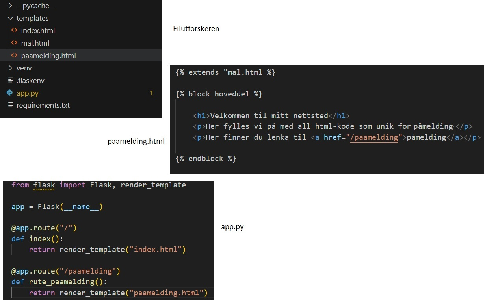

# Lagre og sende data

## Lagre Data

I kapittel 2.8 så vi kort på "form"-elementet, vi går nå tilbake til dette og viser hvordan vi kan ta imot og lagre informasjon fra brukere. Tanken er at man kan fylle ut html-elementene, hvorpå informasjonen sendes til app.py som håndterer den. Dette følger samme prinsipp som når vi gjør et kall på en rute, og app.py sender oss til ønsket nettside. Verdt å merke seg er at vi deler forespørslen/rutekall til serveren i to typer. Den første er såkalte er en request av type "get", som indikerer at vi ønsker å få noe tilbake fra serveren, for eksempel en ny nettside. Denne typen er standard, og vi trenger ikke presisere noe mer enn det vi allerede har gjort. Den andre forespørselen er kalles er av type "post", og brukes når vi ønsker å sende informasjon til serveren. Informasjonen vi skal sende via form-elementet sendes som "post", og dette må vi spesifisere når vi oppretter elementet. 

#### Sende informasjon fra html til app.py

Vi setter opp et nytt Flask prosjekt, og tilsvarende forrige kapittel kan vi legge til siden *paamelding.html*, samt en rute "/paamelding" fra forsiden via app.py:



*Vi setter opp Flask som i forrige delkapittel*

Nå kan vi lage et form-element i påmeldingssiden vår. Les mer om alle mulighetene du har for å samle informasjon på https://www.w3schools.com/html/html_form_elements.asp

```html
    <form action="/tilsendt_data" method="post">
        <label>Navn</label>
        <input name="navn" type="text" placeholder="Ditt navn">
        <label>Navn</label>
        <input name="alder" type="text" placeholder="Din alder">
        <select name="idrett">
            <option value="fotball">Fotball</option>
            <option value="basketball">Basketball</option>
            <option value="volleyball">Volleyball</option>
        </select>
        <button onclick=submit>Meld meg på!</button>
    </form>
```

La oss bryte ned alt vi kan se her. 
- Selve form-elementet kan vi se på som en "konvolutt" som inneholder informasjon, `action`-attributtet forteller oss hvor informasjonen skal, enten til en ny nettside eller som i vårt tilfelle, en rute. Vi setter også `method` til post for å gjøre forespørselen vår om til en "post-melding". Da vet at serveren at den skal ta imot informasjon.

- Informasjonen i "form"-elementet sendes via "input" og "select"-element. Disse må alltid ha attributtene `name` og `value`, som er felter app.py forventer å ta imot. For tekst-feltene er det ikke "value"-attributter, verdien er nemlig det brukeren skriver inn i feltene.

- Label-elementene er rene tekst-element som vi kan bruke for å gi informasjon. Det finnes endel ekstra egenskaper for å koble sammen "label og "input" element, men vi bruker ikke disse. Vi kunne like gjerne brukt "p"-elementer istedet.

- Ved å trykke på knappen sendes hele form-elementet med tilhørende informasjon til destinasjonen vi definerte i "action"-attributtet. Vi har laget ei rute der, slik at det sendes til app.py. Vi må nå kode ruta i app.py. 

#### Ta imot informasjon fra html til app.py

I app.py må vi nå opprette ruta vi kalte "/tilsendt_data". Vi gjør først følgende:

- Importere en ny funksjon fra flask-biblioteket kalt request
- Spesifisere at "/tilsendt_data" skal ta imot "post"-forespørsler (istedet for "get" som er standard.)
- Bruke request-funksjonen til å lagre tilsendt data i egne variable.

```python
from flask import Flask, render_template, request, redirect

@app.route("/tilsendt_data",methods=["POST"])
def rute_paameldingsdata():
    navn = request.form.get("navn")
    alder = request.form.get("alder")
    idrett = request.form.get("idrett")
```

I argumentet til "get"-funksjonen må vi skrive det som står under "name"-attributten fra form-elementet. Da vil verdien lagres i vår nye variabel. Dersom vi ønsker å lagre dataene i en json-fil, husker vi at de må skrives som ei liste eller en ordbok. Vi velger sistnevnte og lagrer ordboka i en json-fil på samme måte som vi lære i kapittel 5.8:

```python
from flask import Flask, render_template, request, redirect

@app.route("/tilsendt_data",methods=["POST"])
def rute_paameldingsdata():
    navn = request.form.get("navn")
    alder = request.form.get("alder")
    idrett = request.form.get("idrett")

    paamelding = {
        navn:{
            "alder": alder,
            "idrett": idrett
        }
    }

    fil = open("paamelding.json", "w")
    json.dump(paamelding,fil,indent=4,ensure_ascii=True)
    fil.close

    return redirect("/paamelding")
```

Ei rute i app.py er ikke ferdig før vi returnerer brukeren dit vi ønsker. Vi kunne ha brukt "render_template" til ei ny html-side, men siden vi allerede har laget ei rute til paamelding.html sender vi brukeren dit ved funksjonen redirect (som må importeres fra flask).

Dersom vi har gjort alt riktig har vi klart å sende informasjon fra påmeldingssiden vår til serveren som har lagret denne i en fil. Json-filer brukes primært til å flytte data, og neste steg ville vært å lagret dataene i en database, men det venter vi med til IT-2.


