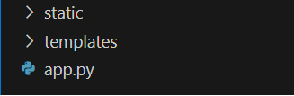

# Start med Flask

### Mapper og Filer

Før du starter med flask må du installere det. Snakk med læreren din for hjelp til dette

Når vi skal sette opp rammeverket, så er det enkelte filer og mapper som må ha spesifikke navn og ligge riktig i forhold til hverandre for at det skal fungere. Vi lager en prosjektmappe med valgfritt navn og legger følgende inn i denne:

- `app.py` er en python fil og fungerer som serveren vår. Vi kan se på fila som et sentralbord vi programmerer. Her skal vi håndtere alle forespørsler fra brukere av siden vår.

- `templates` er en mappe som skal inneholde alle html filene våre

- `static` er en mappe som skal inneholde alle bildene og eventuelle css-filer.




 Vi legger så inn følgende tre linjer i app.py:

```python
from flask import Flask, render_template, request

app = Flask(__name__)

# Vi kommer til å skrive inn all annen serverkode her

app.run(debug=True)

```

Det kreves ikke mer kode for å sette opp serveren i app.py, og vi trenger heller ikke å forstå hva disse linjene gjør. Prøv å kjøre python-fila, og se etter følgende resultat:


Vi ser at vi har fått tilgang til en nettadresse, `http://127.0.0.1:5000`. Dette er forsiden til nettstedet vårt så lenge vi kjører serveren (app.py). Det er denne vi skal bruke heretter, "open in browser" utvidelsen vi brukte tidligere vil ikke lenger fungere. 


### Ruter

På dette tidspunktet vil nettadressen vi får gi en feilmelding. Selv om serveren er skrudd på finnes det jo ingen nettsider å vise!

Vi lager html-fila til forsiden som før ved å opprette en html-fil og legge denne i templates-mappa. Bransjestandarden til forsider er å kalle denne for **index.html**, så vi gjør det samme denne gangen. Til slutt legger vi inn standard skjelett og en overskrift som for eksempel:

```html
<!DOCTYPE html>
<html lang="en">
<head>
    <meta charset="UTF-8">
    <meta name="viewport" content="width=device-width, initial-scale=1.0">
    <title>Document</title>
</head>
<body>
    <h1>Heisann!</h1>
</body>
</html>
```
Nå må nettsiden vi lagde kobles opp til serveren, altså app.py. Dette gjøres ved å opprette ei **rute**. Slike ruter skrives på en spesiell måte:


1. **Type rute:** En enkel regel er at hvis brukeren til nettsiden skal få informasjon fra app.py så skriver vi **get**. Dersom brukeren skal sende informasjon til app.py skriver vi **post**.

2. **Navn på rute:** Første rute vil mer eller mindre alltid returnere forsiden. Denne må ha navnet **/**. Alle andre ruter kan vi bestemme navn på selv

3. **Funksjon**: Vi må legge koden til ruta i en python funksjon. Navnet på funksjonen bestemmer vi selv, men pass på at ulike ruter har ulike funksjonsnavn.

4. **Ekstra kode**: Vi kan legge inn betingelser, løkker og annen kode som styrer logikk her.

5. **Hva skal returneres**: Først og fremst bør vi levere en nettside, men vi kan også legge til python-variable av alle datatyper.

Vi følger denne strukturen og app.py ser nå slik ut:

```python
from flask import Flask, render_template, request

app = flask(__name__)

@app.get("/") 
def rute_forside():
    return render_template("index.html")

app.run(debug=True)
```
Prøv å kjøre app.py og følge lenka du får på nytt. Denne gangen bør nettsiden vises.

Vi kan følge samme prinsipp for nye nettsider. Enn ny nettside i templates-mappa, for eksempel *nyside.html*, kan kobles til app.py ved en tilsvarende rute:

```python
from flask import Flask, render_template # importerer det som trengs fra Flask-biblioteket

app = Flask(__name__) # oppretter en `Flask`-app, som lagres i variabelen `app`

@app.route("/")  # Rute til forsiden vår
def index(): 
    return render_template("index.html") 

@app.route("/nyside") # Her skriver vi ruta til vår nye nettside
def side2():
    return render_template("nyside.html")
```

Dersom vi legger på /nyside i URL-en til forsiden `(http://127.0.0.1:5000/nyside)` skal vi havne på den nye nettsiden. Prøv selv!

### Lenker som ruter

Før jul lærte vi å lenke sammen nettsider med a-element. Dette fungerer som tidligere, med ett viktig unntak. I href-attributtene kan vi ikke lenger skrive den lokale stien til filene, vi må heller skrive inn navnet på ruta som hører til nettsiden.

Se på a-elementene i html-koden:

```html

<!DOCTYPE html>
<html lang="en">
<head>
    <meta charset="UTF-8">
    <meta name="viewport" content="width=device-width, initial-scale=1.0">
    <title>Document</title>
</head>
<body>
    <nav>
        <a href="/">Forside</a>
        <a href="/nyside">Side 2</a>
    </nav>
    <h1>Heisann!</h1>
</body>
</html>
```


### Oppgave 6.2.1

a) Lag et nytt Flask prosjekt: Sett opp templates mappa og app.py som beskrevet i dette kapittelet.

b) Legg til tre html-filer til templates-mappa: `gull.html`, `sølv.html` og `bronse.html`. Fyll de med noe enkel tekst.

c) Lag en felles nav-bar på alle tre sidene. Legg til a-element som kobler alle sammen ved hjelp av ruter i app.py 

