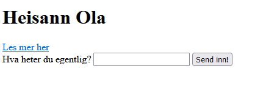

Vi har nå et fungerende Flask prosjekt. Det kan føles som mye nytt arbeid i forhold til før jul, men vi kan nå benytte oss av de nye mulighetene vi presenterte i 6.1. Vi starter ved å vise hvordan vi kan utveksle informasjon mellom en bruker og en server.

### Sende data

Sett opp et Flask prosjekt tilsvarende forrige kapittel, legg til `navn="Ola"` på ruten til forsiden slik som under:

```python
@app.route("/")  # Rute til forsiden vår
def index(): 
    return render_template("index.html", navn="Ola") 
```
Når vi sender forsiden vår til nettleseren sender vi samtidig også med python-variabelen `navn` (med verdien "Ola"). Den kan vi ta imot og bruke på forsiden vår:

```html

<body>
    <h1>Heisann {{navn}}</h1>
    <a href="/nyside">Les mer her</a>
</body>
```

Vi bruker `{{ }}` for at nettleseren skal forstå at det er den tilsendte variabelen navn som skal vises, ikke bare ordet "navn". Sjekk at forsiden skriver ut "Heisann Ola".

Legg merke til at dersom variabelen navn ikke eksisterer i app.py, eller ikke sendes til html-fila vår, så vil feltet bare stå tomt og skrive "Heisann" istedet.

 Foreløpig kan dette virke litt merkelig, vi kunne jo bare skrevet Ola rett inn i html-koden. La oss vise hvordan vi kan bytte navnet ved å sende inn et annet til serveren vår!

 ### Ta imot data

Det finnes flere måter å sende data tilbake til serveren på, og felles for de er at det er litt mer komplisert enn å få de tilsendt. Du husker kanskje `form`-elementet i kapittel 2.5? Det var et eksempel på hvordan vi kunne lage blant annet registreringsskjema på nettsiden, og nå har vi endelig muligheten til å få de til å fungere.

Vi legger inn et form-element i forsiden vår:

```html
<body>
    <h1>Heisann {{navn}}</h1>
    <a href="/nyside">Les mer her</a>¨

    <form action="/nytt_navn" method="post">
        <label>Hva heter du egentlig?</label>
        <input type="text" name="navn">
        <button>Send inn!</button>
    </form>

</body>
```



Følgende må være oppfylt for at serveren kan ta imot det vi skriver i input-feltet:

- action="/nytt_navn" attributtet tilsvarer en rute som må skrives i app.py. Det er denne ruta som skal ta imot informasjonen

- Ettersom vi sender ekstra data til serveren må vi spesifisere dette ved å sette på method="post" attributtet

- Alt vi sender inn må i utgangspunktene ha attributtene `name` og `value`, altså avsender og innhold. Input-feltet av type tekst er et unntak ettersom som ikke trenger `value` (fordi innholdet tilsvarer det vi skriver i tekstfeltet)

Nå må vi skrive serverkode i app.py som tar imot navnet. Denne må skrives under ruta "/nytt_navn" ettersom det var det vi kalte den i action-attributtet. Vi må også spesifisere at den skal håndtere en "post" forespørsel ved å skrive @app-post() istedet for @app.get()

```python
@app.post("/nytt_navn")
def nytt_navn():
    navn = request.form.get("navn") # Vi tar imot informasjon fra avsender og lagrer innholdet
    return render_template("index.html", navn = navn) #Sender det nye navnet tilbake til forsiden.

```
Dersom alt fungerer som det skal, så kan du endre hilsenen på forsiden ved å skrive inn navn i tekstfeltet og sende det inn.

Dette er bare en liten forsmak på mulighetene vi har når vi jobber med rammeverket. De neste kapittelene går mer i dybden på hva vi kan få til.

### Oppgave 6.3.1

Fortsett å jobbe med nettsiden i avsnittene over.

a) Send variabelen `alder = "18"` fra ruta app.py og bruk denne til å skrive ut alderen på html-siden.

b) Lag et form-element som i eksemepelet over der du kan fylle inn ny alder. Ta det imot i app.py i variabelen alder. Sjekk så variabelen i konsollen ved å bruke "print(alder)" i app.py 


### Oppgave 6.3.2

Lag mappe og sett den opp som et Flask prosjekt.

Send en liste med fem typer frukt fra app.py til en nettside. Skriv ut lista i et h3 element.
