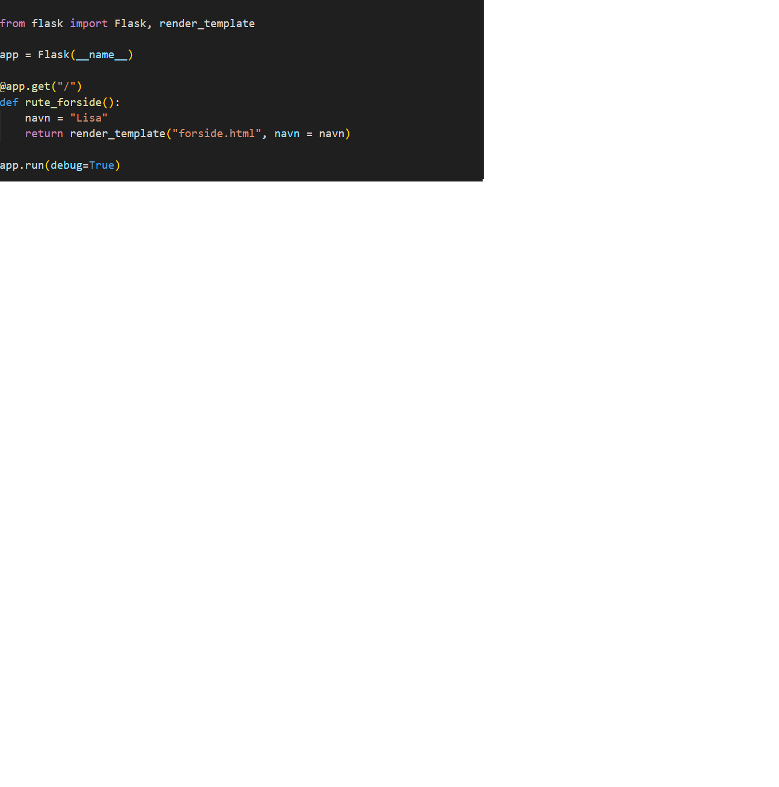
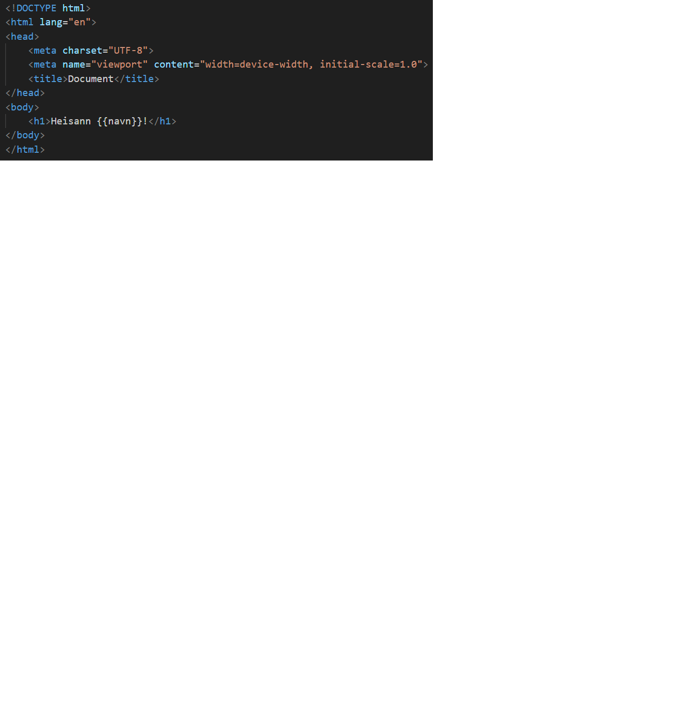

# Vi koder mer avanserte Nettsider

I dette delkapittelet forutsettes det at du har vært gjennom kapittel 6.2 og 6.3 og kan sette opp en enkel nettside med Flask. Det forutsettes også at du har grei kontroll på de grunnleggende programmerings-teknikkene vi har vært gjennom. Målet er nå nemlig å kombinere dette for å lage langt mer avanserte funksjonalitet. Vi ønsker å programmere nettsidene våre, ikke bare i `app.py`, men på selve html-fila.

:::info

Mye av det vi skal gjennom i dette delkapittelet kunne vært løst mer elegant med javascript. Da kan man kode rett inn i et script-element i hmtl-filene istedet for å bruke Flask.  Dersom du ønsker å gå mer i dybden med webdesign etter videregående kan det være smart å se nærmere på javascript. Det finnes mange gode ressurser på nettet for å komme igang, for eksempel https://runestone.academy/ns/books/published/JS4Python/index.html (Kap 2 og 5)

:::

Start ved å opprette et Flask prosjekt slik du forhåpentligvis har prøvd noen ganger nå. (Legg merke til at vi sender et navn fra app.py til forsiden og skriver det ut der):

<table>
  <thead>
    <tr>
      <th>app.py</th>
      <th>forside.html</th>
    </tr>
  </thead>
  <tbody>
    <tr>
      <td></td>
      <td></td>
    </tr>
  </tbody>
</table>


*Det aller enkleste oppsettet for en forside med Flask. Husk å opprette mappestrukturene der filene skal ligge på riktig måte*

Vi ønsker å programmere rett inn i html-fila vår. Dersom vi hadde lært javascript kunne vi ha laget et `<script></script>`- element og begynt kodingen. Slik funksjonalitet finnes ikke innebygd for python, men vi kan få det til likevel. Det gjør vi ved å bruke spesielle symboler fra Flask (slik vi brukte `{{ }}`for å hente variable i forrige kapittel). Vi skal nå bruke symbolene ``. 

:::info

Hvorfor bruker man så mange rare symboler? Hvorfor bruker vi av og til `{{ }}` og andre ganger ``? Hva er forskjellen? Dette kan frustrere mang en VGS elev som prøver å lære seg IT-1. Når det er mange systemer som skal virke sammen og alt skal oversettes til 0 og 1, så blir det fort innviklet. Selv erfarene utviklere må sette seg inn i "bruksanvisningen" når de lærer seg nye verktøy. 

:::

### Betingelser

La oss legge til en betingelse som sjekker navnet vi får tilsendt. Vi endrer litt på html-fila:

```html
<!DOCTYPE html>
<html lang="en">
<head>
    <meta charset="UTF-8">
    <title>Mitt Prosjekt</title>       
</head>
<body>
     <!--Her trenger vi ikke doble parenteser rundt navn fordi vi allerede skriver python, ikke html -->
        <h1>Heisann {{navn}}! Velkommen tilbake</h1>
    
    
        <h1>Hei! Hvem er du? Kanskje du skal lage en bruker?</h1>
    
</body>
</html>
```

*Prøv å bytte navn i app.py til noe annet enn Lisa. Sjekk at overskriften til forsiden isåfall endrer seg*

Vi har nå laget en `dynamisk nettside`. Det vil si at samme nettside kan ha ulikt utseende avhengig av forutsetningene vi har bestemt. Dette i motsetning til statiske nettsider som alltid var like, slik vi har jobbet med frem til nå. Siden vår er ikke spesielt avansert, men det skal ikke så mye til for å få til mer:

#### Oppgave 6.4.1

Ta utgangspunkt i nettsiden over, du kan fjerne betingelsen som ble lagt til i html-fila.

a) Lag et `<form> </form>` element på forsiden. Legg til to inputfelter, et for brukernavn og et for passord. Send disse til app.py 

b) Ta imot brukernavn og passord i app.py. Lag også en variabel kalt `godkjent` som du setter til `False`. 

c) Lag en betingelse i app.py, den skal sjekke om navn og passord du fikk inn stemmer med et navn og passord du velger selv. Dersom begge stemmer kan du sette `godkjent` til `True`, ellers står den fortsatt på `False`.

d) I ruta til forsiden sender du nå `godkjent` til nettsiden. Lag en betingelse på nettsiden som sjekker om `godkjent` er `True` eller `False`. I betingelsen kan du skrive passende beskjed ("Velkommen" eller "Ugyldig brukernavn eller passord")


