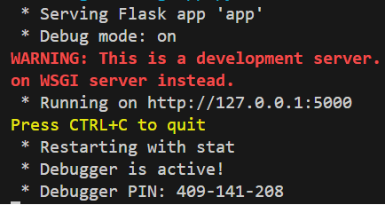
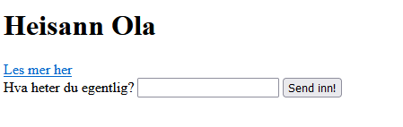

# Sette opp Flask

### Mapper, Filer og Ruter

Når vi skal sette opp en struktur som beskrevet i forrige avsnitt, så er det enkelte filer og mapper som må ha spesifikke navn og ligge riktig i forhold til hverandre for at rammeverket skal fungere. Vi lager en prosjektmappe med valgfritt navn og legger følgende inn i denne:

- app.py er en python fil som skal fungere som serveren vår. Denne fungerer som et sentralbord og skal håndtere alle forespørsler fra brukere av siden vår.

- templates er en mappe som skal inneholde alle html filene våre

- static er en mappe som skal inneholde alle bildene og eventuelle css-filer.


Flask er et hjelpeverktøy som krever relativt lite for å sette opp. Vi gjør legger inn følgende tre linjer i app.py:

```python
from flask import Flask, render_template

app = flask(__name__)

# Vi kommer til å skrive inn all annen serverkode her

app.run(debug=True)

```

Vi kan nå kjøre python-koden og vil få servert følgende resultat



Vi ser at vi har fått en nettadresse, `http://127.0.0.1:5000`, som viser oss nettstedet vårt så lenge vi kjører server-fila vår. Det er denne vi skal bruke heretter, "open in browser" utvidelsen vi brukte tidligere vil ikke lenger fungere. 

Dersom vi følger på adressen nå får vi en feilmelding tilbake. Selv om serveren er skrudd på, har den ingen instruksjoner for hva som skal skje når noen besøker nettstedet, og det finnes jo heller ingen nettsider å vise!

Vi starter derfor å lage forsiden til nettstedet vårt. Vi oppretter en html-fil og legger denne i `templates` mappa. Så skriver vi et standard skjelett og en overskrift som for eksempel:

```html
<!DOCTYPE html>
<html lang="en">
<head>
    <meta charset="UTF-8">
    <meta name="viewport" content="width=device-width, initial-scale=1.0">
    <title>Document</title>
</head>
<body>
    <h1>Heisann!</h1>
</body>
</html>
```

Vi er fortsatt ikke i mål, vi må nå legge inn kode i app.py som skal koble URL-en vår opp til nettsiden vi akkurat laget. Dette kalles for en rute og ser ut som følger:

```python
from flask import Flask, render_template, request

app = flask(__name__)

@app.get("/")
def rute_forside():
    return render_template("index.html")

app.run(debug=True)
```

De som lager Flask har bestemt at ruta til forsiden alltid skal hete "/". Nå vil funksjonen "rute_forside()" kjøres hver gang noen besøker forsiden til nettstedet. Denne sørger for at  html fila leveres tilbake til brukerens nettleser.

La oss lage enda en nettside, vi lager en ny html-fil som vi lagrer i "templates", for eksempel `nyside.html`. For å nå denne siden legger vi som før inn et a-element på forsiden vår, men det kan ikke lenger se ut som følger: `<a href="nyside.html>Les mer her</a>` Det er fordi da forutsetter vi at brukeren allerede har lastet ned nyside.html på forhånd. Det gir jo ikke mening i virkeligheten vi slipper heldigvis å laste ned alle nettsidene til et nettsted før vi besøker det.

Vi må istedet må vi sende en forespørsel til app.py og lage ei ny rute der som håndterer forespørselen. Navnet på ruta bestemmer vi selv. Vi kan for eksempel skrive `<a href="/nyside">Les mer her</a>`. Forsiden vår kan dermed se ut som følger:

````html
<!DOCTYPE html>
<html lang="en">
<head>
    <meta charset="UTF-8">
    <meta http-equiv="X-UA-Compatible" content="IE=edge">
    <meta name="viewport" content="width=device-width, initial-scale=1.0">
    <title>Flask - VGS</title>
</head>
<body>
    <h1>Heisann</h1>
    <a href="/nyside">Les mer her</a>
</body>
</html>
````

Vi har kalt ruten vår for `/nyside`. Neste steg er å gå til app.py og lage den ferdig på samme måte som ruta til forsiden:


```python
from flask import Flask, render_template # importerer det som trengs fra Flask-biblioteket

app = Flask(__name__) # oppretter en `Flask`-app, som lagres i variabelen `app`

@app.route("/")  # Rute til forsiden vår
def index(): 
    return render_template("index.html") 

@app.route("/nyside") # Her skriver vi ruta til vår nye nettside
def side2():
    return render_template("nyside.html")
```

**Det kan være lurt å trene litt på dette ved å lage et par html nettsider til, og koble de sammen på nettstedet ved hjelp av ruter.**

Alt vi lærte om html og css før vi tok i bruk Flask kan vi nå bruke til å lage de samme nettstedene vi tidligere har laget. Den eneste forskjellen hittil er altså at vi bruker en web-server, `app.py` og at lenkene mellom sidene må skrives som ruter og programmeres. Heldigvis får vi i tillegg nye muligheter til å bruke programmering for å få til langt mer avansert funksjonalitet! 

Serveren vår kan for eksempel både sende og ta imot ekstra data fra nettleseren/bruker, noe som gir oss uante muligheter. La oss starte med enkle varianter av disse prinsippene.

### Sende data

Vi starter med å endre litt på ruten til forsiden:

```python
@app.route("/")  # Rute til forsiden vår
def index(): 
    return render_template("index.html", navn="Ola") 
```
Når vi sender forsiden vår til nettleseren sender vi samtidig også med python-variabelen `navn`. Den kan vi ta imot og bruke på forsiden vår:

```html

<body>
    <h1>Heisann {{navn}}</h1>
    <a href="/nyside">Les mer her</a>
</body>
```

Vi bruker `{{ }}` for at nettleseren skal forstå at det er den tilsendte variabelen navn som skal skrives, ikke bare "navn". Nå vil nettsiden skrive ut "Heisann Ola"

Legg merke til at dersom variabelen navn ikke eksisterer i app.py, eller ikke sendes til html-fila vår, så vil feltet bare stå tomt og skrive "Heisann" istedet.

 Foreløpig kan dette virke litt  merkelig, vi kunne jo bare skrevet Ola rett inn i html-koden vår. La oss vise hvordan vi kan bytte navnet ved å sende inn et annet til serveren vår!

 ### Ta imot data

Det finnes flere måter å sende data tilbake til serveren på, og felles for de er at det er litt mer komplisert enn å få de tilsendt. Du husker kanskje `form`-elementet i kapittel 2.5? Det var et eksempel på hvordan vi kunne lage blant annet registreringsskjema på nettsiden, og nå har vi endelig muligheten til å få de til å fungere.

Vi legger inn et form-element i forsiden vår:

```html
<body>
    <h1>Heisann {{navn}}</h1>
    <a href="/nyside">Les mer her</a>¨

    <form action="/nytt_navn" method="post">
        <label>Hva heter du egentlig?</label>
        <input type="text" name="navn">
        <button>Send inn!</button>
    </form>

</body>
```



Følgende må være oppfylt for at vi kan sende inn navnet vi skriver i input-feltet:

- action="/nytt_navn" attributtet tilsvarer en rute som må skrives i app.py. Det er denne ruta som skal ta imot informasjonen

- Ettersom vi sender ekstra data til serveren spesifiserer vi dette ved å sette på method="post" attributtet

- Alt vi sender inn må i utgangspunktene ha attributtene `name` og `value`, altså avsender og innhold. Input-feltet av type tekst er et unntak ettersom som ikke trenger `value` fordi innholdet tilsvarer det vi skriver i tekstfeltet.

Nå må vi skrive serverkode i app.py som tar imot navnet. Denne må skrives under ruta "/nytt_navn" ettersom det var det vi kalte den i action-attributtet.

```python
@app.post("/nytt_navn")
def nytt_navn():
    navn = request.form.get("navn") # Vi tar imot informasjon fra avsender og lagrer innholdet
    return render_template("index.html", navn = navn) #Sender det nye navnet tilbake til forsiden.

```
Dersom alt fungerer som det skal, så kan du endre hilsenen på forsiden ved å skrive inn navn i tekstfeltet og sende det inn.

Dette er bare en liten forsmak på mulighetene vi har når vi jobber med rammeverket. De neste kapittelene går mer i dybden på hva vi kan få til.

