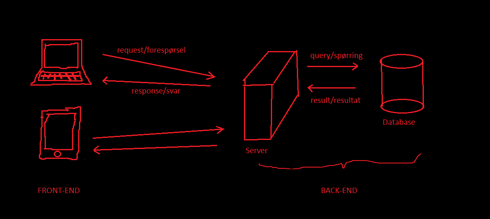

# Hva har vi lært?

Frem til nå har vi jobbet mye med de grunnleggende byggesteinene for utvikling av webapplikasjoner nemlig html og css. Disse er ikke programmeringsspråk, men er en måte og strukturere og posisjonere innholdet en nettside har. Vi har også sett på grunnleggende programmering, i dette kurset python. Vi kunne alternativt ha jobbet med Javascript, et populært programmeringsspråk for web-utvilkere som er tilrettelagt for å lett kunne lage interaktive nettsider. Vi valgte Python fordi det er enklere å forholde seg til, men dersom du behersker Python er det ikke spesielt vanskelig å lære seg grunnleggende Javascript på egenhånd.

Vi har nå teoretisk gode muligheter og verktøy for å lage fine nettsider, men vi er fortsatt et stykke unna virkeligheten. Html, css- og mediefilene vi lager må for eksempel ligge lagret på datamaskinen for at de skal kunne vises. Slik er det heldigvis ikke med internett slik du er vant med. Dersom du besøker en nettavis slipper du jo å laste ned alle bildene og filene på forhånd. Så hvordan fungerer det? Filene eksisterer fortsatt, men de ligger på en server. Når vi skriver eller klikker på en lenke på nettet kommuniserer vi med en slik server, som gir nettleseren vår html-kode, bilder og annen informasjon som til enhver tid trengs for å kunne vise nettsiden. I dette kapittelet skal vi forsiktig nærme oss denne måten å lage nettsteder på. Vi starter med litt teori om hvordan det hele fungerer.

:::info

Definisjon av en server: En server (også kjent som en tjener) er en programvare som tilbyr («serverer») en eller flere tjenester til andre datamaskiner (klienter) over et datanettverk.  

:::

# Nye begrep

### Front-end og Back-end

For å få bedre oversikt over miljøet rundt en web-applikasjon er det endel nye begrepep vi må gjennom. Alt som har med utseende og hvordan din interaksjon som **bruker** av en nettside fungerer er noe vi kaller for `front-end`. Det er på dette nivået vi har jobbet så langt. Som sagt har ikke brukeren tilgang til noen av filene våre, de ligger på sin egen `server`. Det må dermed foregå kommunikasjon mellom din datamaskin og serveren. 

Et annet mer omfattende eksempel er når du besøker nettbanken din. Når du i har fylt ut det du trenger for å logge deg på, så sendes informasjonen til en server for å behandles. Serveren er programmert til sjekke om din autentisering stemmer, hente frem relevant informasjon om deg og dine kontoer, for så å sende alt tilbake og generere en nettside som er unik for deg. Hele denne prosessen skjer usynlig for oss brukere og kalles derfor for `back-end`. 

Bildet ovenfor er en enkel modell over hva som skjer. Legg merke til at back-end delen er delt i to, nemlig serveren som hånderer alle forespørsler og en `database` som har all informasjonen nettstedet trenger. Selv om disse to er delt i to betyr ikke det nødvendigvis at de er fysisk separert. Det er snarere forskjellig språk og programvare som håndterer de ulike delene. Nettbanken kommuniserer dermed med databasen for å få all din kontoinformasjon før dette sendes tilbake til din skjerm.

### Statiske og Dynamiske Nettsider

Når utseende på en nettside endres som en følge av informasjon vi sender til systemet så kalles det for en `dynamisk` nettside. Det er en motsetning til nettsidene vi har laget hittil som alltid er like for alle som besøker de. Disse kalles for `statiske` nettsider. 

### Rammeverk/Flask

Alle disse ulike delene har i tillegg masse forskjellige hjelpeverktøy som gjør jobben enklere for de som jobber med front-end, back-end eller begge deler. Blant annet ferdiglagde pakker som kalles for `rammeverk`. Språkene som brukes er fortsatt de samme, men rammeverkene gjør samme jobb raskere og mer effektiv. 

I resten av kapittelet skal vi lage noen dynamiske nettsider der vi også skal programmere back-end serveren. Vi skal bruke et rammeverk som kalles for Flask for å hjelpe oss. 
