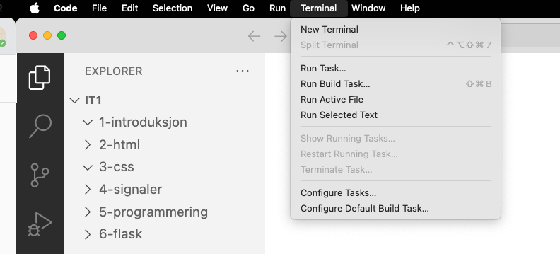
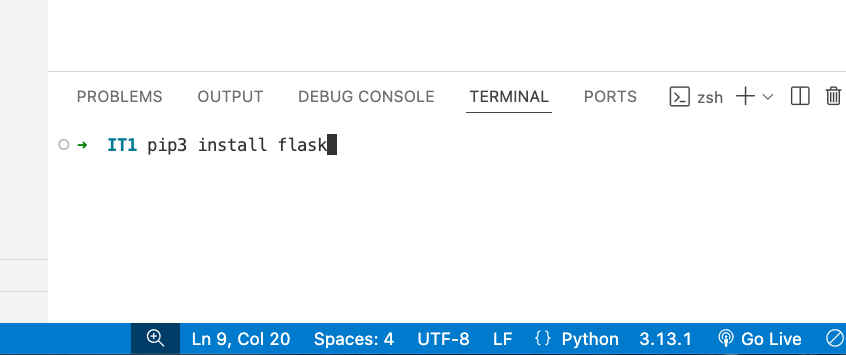
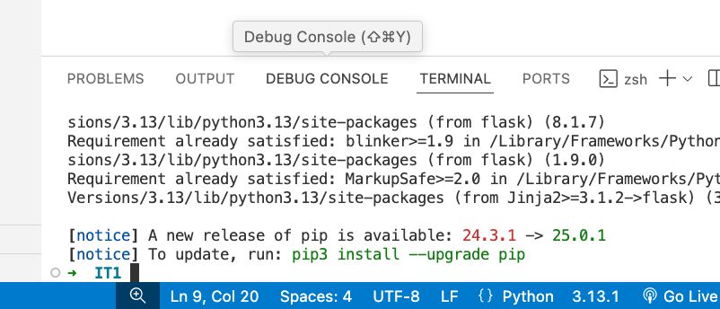
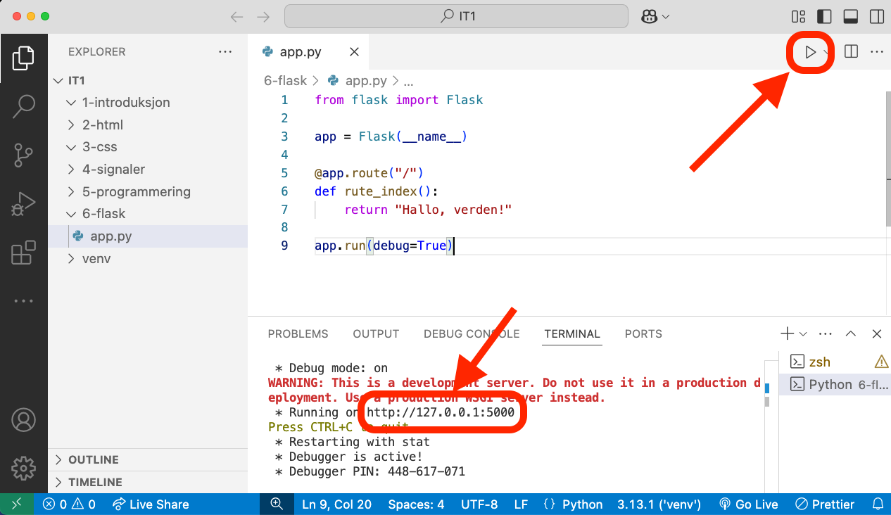
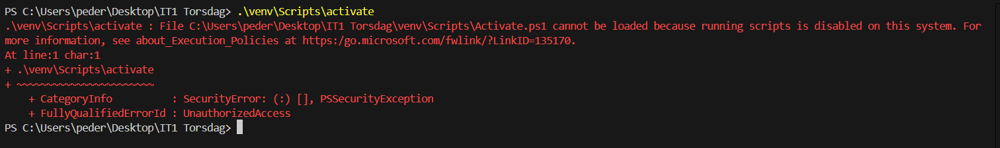
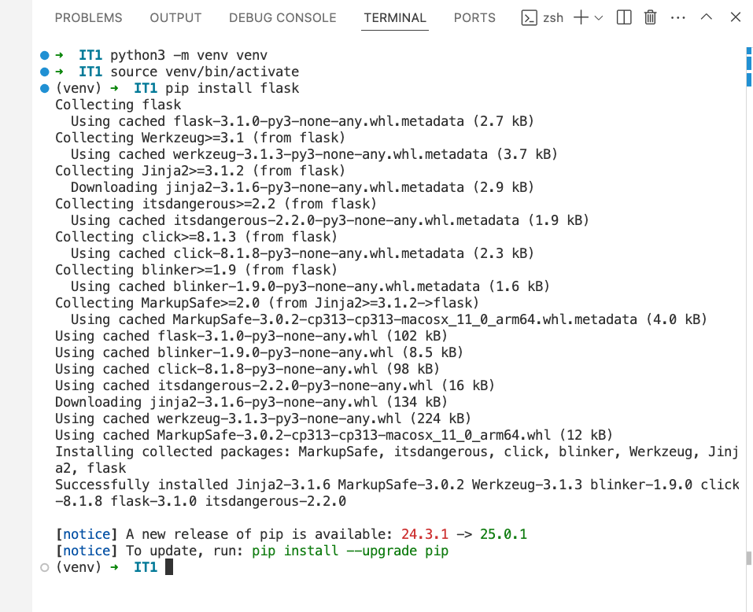
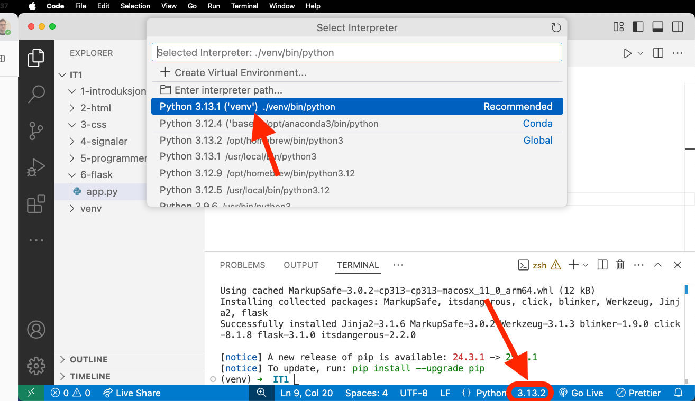

# Oppsett av flask

## IT1

1. Åpne en ny terminal i VS Code



2. Skriv `pip3 install flask` (mac) / `pip install flask` (windows) i terminalen og trykk enter



3. Hvis alt gikk bra får du noe som ligner dette i terminalen:



4. Nå kan du kjøre .py-filer som inneholder flask-prosjekter ved å klikke på play-knappen.



### Kjøre usignerte scripts i windows



Hvis du har windows og får feilmeldingen over, må du kjøre denne kommandoen i terminalen:

```powershell
Set-ExecutionPolicy RemoteSigned
```

> Velg `YES TO ALL`


## IT2 - Med virtuelt miljø (venv)

I IT2 installerer vi en del pakker, og da er det lurt å opprette et eget virtuelt python-miljø for IT-mappen vår.
[Les mer om hvorfor her: stackoverflow - why is virtualenv necessary?](https://stackoverflow.com/questions/23948317/why-is-virtualenv-necessary)

1. Åpne en ny terminal i VS Code


2. Skriv følgende kommandoer i terminalen - trykk enter mellom hver kommando

```bash
# windows
python -m venv venv
.\venv\Scripts\activate
pip install flask

# mac
python3 -m venv venv
source venv/bin/activate
pip install flask
```



3. Velg riktig _interpreter_ i VS Code, i en `.py`-fil klikk på tallene 3.xx nede i høyre hjørne for å bytte python-interpreter. Velg `(venv)`.



4. Klikk play for å kjøre

